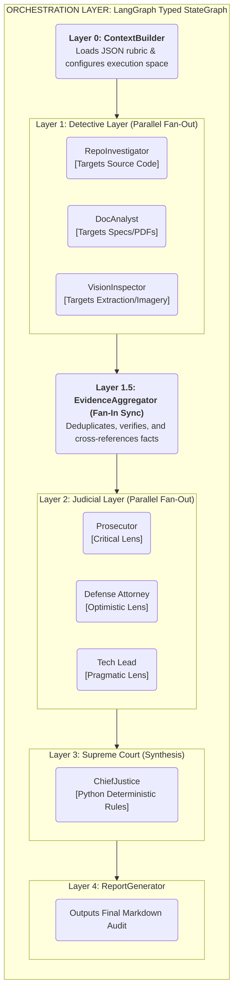
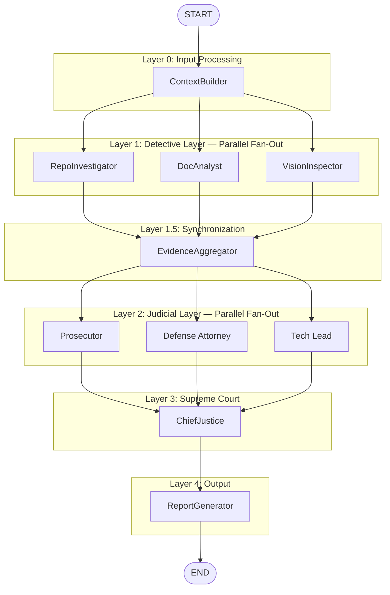
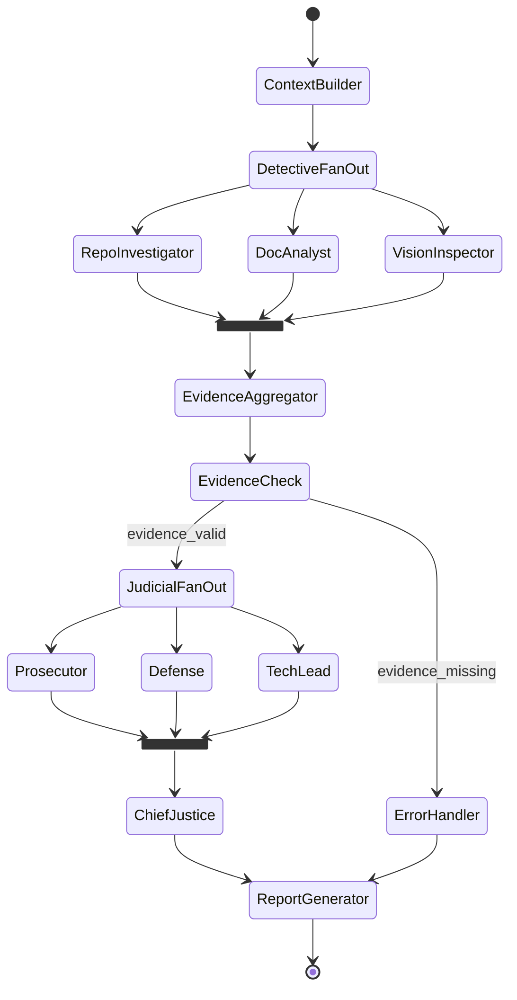
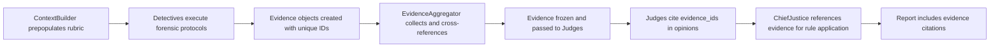
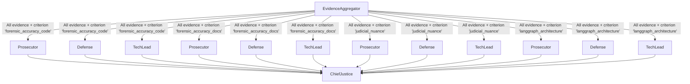
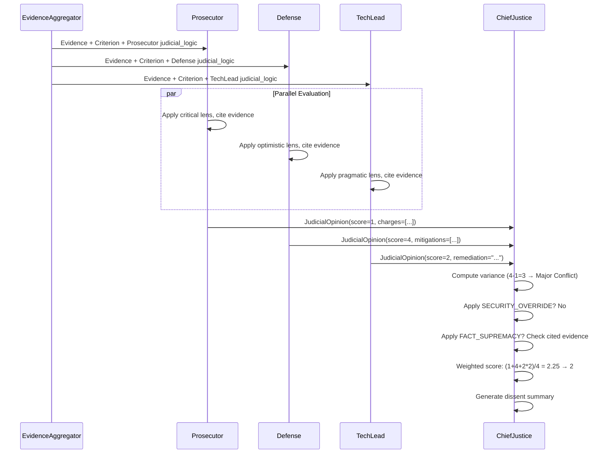
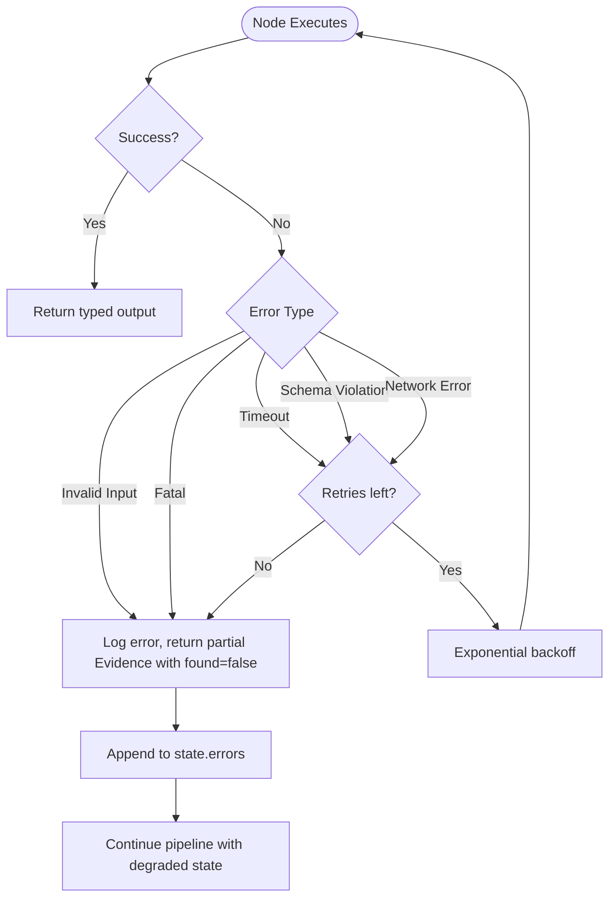
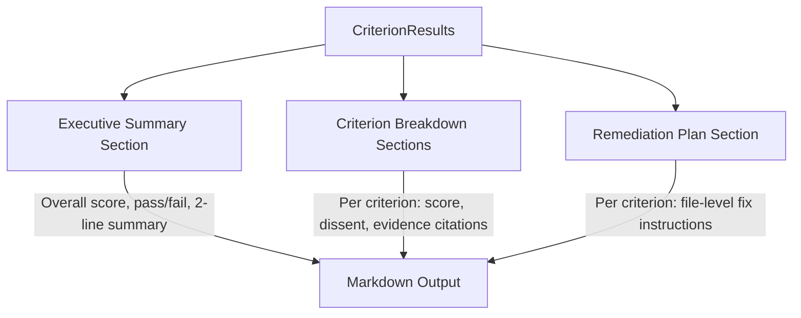

# ARCHITECTURE NOTES — Digital Courtroom System

> **Document Type:** Internal Technical Architecture Specification
> **System:** Automaton Auditor — Digital Courtroom
> **Version:** 1.0.0
> **Status:** Design

---

## 1. System Overview

### 1.1 Architectural Goals

| ID   | Goal                                   | Constraint                                            |
| ---- | -------------------------------------- | ----------------------------------------------------- |
| AG-1 | Hierarchical multi-agent orchestration | Must use LangGraph `StateGraph` with typed state      |
| AG-2 | Parallel forensic evidence collection  | Fan-out/fan-in pattern for 3 detective agents         |
| AG-3 | Adversarial judicial evaluation        | 3 independent judge personas per rubric criterion     |
| AG-4 | Deterministic verdict synthesis        | Python rule engine, not LLM-based averaging           |
| AG-5 | Production-grade audit report output   | Structured Markdown with scores, dissent, remediation |
| AG-6 | Sandboxed tool execution               | All external operations in isolated temp directories  |

### 1.2 Non-Functional Requirements

| Requirement         | Specification                                                                                                                                                                                                                             |
| ------------------- | ----------------------------------------------------------------------------------------------------------------------------------------------------------------------------------------------------------------------------------------- |
| **Determinism**     | Given identical inputs (repo snapshot + PDF), the detective layer must produce identical evidence. Judicial scores may vary within ±1 due to LLM non-determinism (mitigated by `temperature=0`). Synthesis rules are fully deterministic. |
| **Reproducibility** | All runs traced via LangSmith. Evidence objects are immutable after creation. Final report references specific evidence IDs.                                                                                                              |
| **Safety**          | No `os.system()`. All subprocess calls use list-form arguments. Git clone targets `tempfile.TemporaryDirectory()`. URL inputs validated against injection patterns.                                                                       |
| **Scalability**     | Detective agents run in parallel (bounded by LLM rate limits). Judge agents run in parallel per criterion batch. No shared mutable state between parallel branches.                                                                       |
| **Observability**   | LangSmith tracing on all LLM calls. Structured JSON logs at each node boundary. Full state snapshots at fan-in synchronization points.                                                                                                    |

### 1.3 Governance Constraints

- The rubric JSON (`rubric/week2_rubric.json`) is the single source of truth for evaluation criteria.
- Agents must not invent criteria not present in the rubric.
- Security violations override all other scoring considerations.
- Forensic evidence (facts) always overrules judicial interpretation (opinions).

---

## 2. High-Level Architecture

### 2.1 Layer Decomposition




### 2.2 Full System Architecture Diagram



### 2.3 StateGraph Flow Diagram



### 2.4 Conditional Routing Logic

| Condition Point            | Check                                         | True Route                                   | False Route                            |
| -------------------------- | --------------------------------------------- | -------------------------------------------- | -------------------------------------- |
| Post-ContextBuilder        | `repo_url` is valid AND `pdf_path` exists     | DetectiveFanOut                              | ErrorHandler → generate partial report |
| Post-EvidenceAggregator    | At least 1 evidence object per detective      | JudicialFanOut                               | Skip missing detective; log warning    |
| Post-JudicialFanIn         | All 3 judges returned valid `JudicialOpinion` | ChiefJustice                                 | Retry failed judge (max 2 retries)     |
| ChiefJustice High-Variance | Score variance > 2 for any criterion          | Re-evaluate with additional evidence context | Proceed with standard synthesis        |

---

## 3. Detailed Component Specifications

### 3.1 ContextBuilder Node

| Property           | Value                                                                                     |
| ------------------ | ----------------------------------------------------------------------------------------- |
| **Responsibility** | Load rubric JSON, validate inputs, prepare initial state                                  |
| **Input**          | `repo_url: str`, `pdf_path: str`                                                          |
| **Output**         | `rubric_dimensions: List[Dict]`, validated `repo_url` and `pdf_path`                      |
| **Tools**          | `json.load()`, `os.path.exists()`, URL regex validation                                   |
| **Failure Modes**  | Invalid URL format, missing PDF file, malformed rubric JSON                               |
| **Retry Logic**    | None — fail fast with descriptive error                                                   |
| **Observability**  | Log loaded rubric version, dimension count, input validation status                       |
| **Security**       | Validate URL does not contain shell metacharacters; reject `file://` and `localhost` URLs |

### 3.2 RepoInvestigator Node

| Property           | Value                                                                                                    |
| ------------------ | -------------------------------------------------------------------------------------------------------- |
| **Responsibility** | Clone repo, run AST analysis, extract git history                                                        |
| **Input**          | `repo_url`, `rubric_dimensions` (filtered by `target_artifact == "github_repo"`)                         |
| **Output**         | `{"evidences": {"repo": List[Evidence]}}`                                                                |
| **Tools**          | `subprocess.run(["git", "clone", ...])`, `ast.parse()`, `ast.walk()`, `gitingest`                        |
| **Failure Modes**  | Clone failure (auth, network, invalid URL), AST parse error (syntax errors in target repo), timeout      |
| **Retry Logic**    | Clone: 2 retries with 5s backoff. AST: skip unparseable files, log warning.                              |
| **Observability**  | Log clone duration, file count, AST parse success/failure per file                                       |
| **Security**       | Clone into `tempfile.TemporaryDirectory()`. Arguments as list (no shell). Timeout: 60s. Cleanup on exit. |

**Forensic Protocols Executed:**

```python
# Protocol A: State Structure Verification
def check_state_structure(repo_path: str) -> Evidence:
    """AST-scan for BaseModel/TypedDict subclasses containing Evidence and JudicialOpinion fields."""

# Protocol B: Graph Wiring Verification
def check_graph_wiring(repo_path: str) -> Evidence:
    """AST-scan for StateGraph instantiation, add_edge/add_node calls, fan-out patterns."""

# Protocol C: Git Narrative Analysis
def check_git_narrative(repo_path: str) -> Evidence:
    """Extract commit log, count commits, analyze progression pattern and timestamps."""

# Protocol D: Safe Tool Engineering
def check_tool_safety(repo_path: str) -> Evidence:
    """Scan for os.system usage, tempfile usage, error handling around subprocess calls."""

# Protocol E: Structured Output Enforcement
def check_structured_output(repo_path: str) -> Evidence:
    """Scan judge nodes for .with_structured_output() or .bind_tools() usage."""
```

### 3.3 DocAnalyst Node

| Property           | Value                                                                                                                     |
| ------------------ | ------------------------------------------------------------------------------------------------------------------------- |
| **Responsibility** | Parse PDF, search for key concepts, cross-reference file paths                                                            |
| **Input**          | `pdf_path`, `rubric_dimensions` (filtered by `target_artifact == "pdf_report"`), `evidences.repo` (for cross-referencing) |
| **Output**         | `{"evidences": {"docs": List[Evidence]}}`                                                                                 |
| **Tools**          | `docling` (PDF parser), text chunking, keyword search                                                                     |
| **Failure Modes**  | Corrupt PDF, empty PDF, encoding errors, oversized document                                                               |
| **Retry Logic**    | PDF parse: 1 retry. If fails, create Evidence with `found=False`                                                          |
| **Observability**  | Log PDF page count, chunk count, keyword hit count                                                                        |
| **Security**       | PDF parsed in memory only; no execution of embedded scripts. Max file size: 50MB.                                         |

### 3.4 VisionInspector Node

| Property           | Value                                                                                       |
| ------------------ | ------------------------------------------------------------------------------------------- |
| **Responsibility** | Extract images from PDF, classify architecture diagrams                                     |
| **Input**          | `pdf_path`, `rubric_dimensions` (filtered by `target_artifact == "extracted_images"`)       |
| **Output**         | `{"evidences": {"vision": List[Evidence]}}`                                                 |
| **Tools**          | Image extraction (`docling` or `PyMuPDF`), multimodal LLM                                   |
| **Failure Modes**  | No images in PDF, LLM vision API failure, unsupported image formats                         |
| **Retry Logic**    | LLM call: 2 retries with exponential backoff. No images: return Evidence with `found=False` |
| **Observability**  | Log image count extracted, classification results                                           |
| **Security**       | Images processed in memory; no disk writes outside temp dir                                 |

### 3.5 EvidenceAggregator Node

| Property           | Value                                                                           |
| ------------------ | ------------------------------------------------------------------------------- |
| **Responsibility** | Collect all detective outputs, validate completeness, perform cross-referencing |
| **Input**          | Full `evidences` dict (merged via `operator.ior` reducer)                       |
| **Output**         | Validated `evidences` dict with cross-reference annotations                     |
| **Tools**          | None (pure Python logic)                                                        |
| **Failure Modes**  | Missing detective output (detective failed entirely)                            |
| **Retry Logic**    | None — proceed with available evidence, flag missing sources                    |
| **Observability**  | Log evidence count per source, cross-reference match/mismatch counts            |

**Cross-Reference Logic:**

```python
def cross_reference(evidences: Dict[str, List[Evidence]]) -> List[Evidence]:
    """
    Compare file paths claimed in doc evidence against
    actual paths found in repo evidence. Flag mismatches
    as 'Hallucinated Path' evidence items.
    """
```

### 3.6 Judge Nodes (Prosecutor, Defense, TechLead)

| Property           | Value                                                                                  |
| ------------------ | -------------------------------------------------------------------------------------- |
| **Responsibility** | Evaluate evidence per rubric criterion through persona-specific lens                   |
| **Input**          | `evidences` (all), `rubric_dimensions` (all — judges evaluate every criterion)         |
| **Output**         | `{"opinions": List[JudicialOpinion]}` — one opinion per criterion                      |
| **Tools**          | LLM with `.with_structured_output(JudicialOpinion)`                                    |
| **Failure Modes**  | LLM returns free text (schema violation), LLM timeout, hallucinated evidence citations |
| **Retry Logic**    | Schema violation: retry up to 2 times. Timeout: retry once with reduced context.       |
| **Observability**  | Log per-criterion scores, argument length, cited evidence IDs, retry count             |
| **Security**       | Evidence is read-only. Judges cannot modify state beyond appending opinions.           |

**Persona System Prompt Construction:**

```python
def build_judge_prompt(persona: str, criterion: Dict, evidence_summary: str) -> str:
    """
    Dynamically construct system prompt from:
    1. Persona philosophy (hardcoded per judge type)
    2. Explicit success_pattern and failure_pattern rules from rubric JSON
    3. Serialized evidence relevant to criterion["target_artifact"]
    """
```

### 3.7 ChiefJustice Node

| Property           | Value                                                                                |
| ------------------ | ------------------------------------------------------------------------------------ |
| **Responsibility** | Resolve judicial conflicts via deterministic rules, produce final scores             |
| **Input**          | `opinions: List[JudicialOpinion]`, `evidences`, `synthesis_rules` from rubric        |
| **Output**         | `{"final_report": AuditReport}`                                                      |
| **Tools**          | None — pure Python deterministic logic                                               |
| **Failure Modes**  | Missing opinions for a criterion (judge failed), invalid score values                |
| **Retry Logic**    | None — deterministic. Missing opinions handled by fallback rules.                    |
| **Observability**  | Log per-criterion: raw scores, variance, applied rules, final score, dissent summary |
| **Security**       | Output is read-only Markdown string. No external calls.                              |

---

## 4. State Design

### 4.1 Full State Schema

```python
import operator
from datetime import datetime
from enum import Enum
from typing import Annotated, Any, Dict, List, Literal, Optional
from pydantic import BaseModel, Field, field_validator
from typing_extensions import TypedDict


class EvidenceClass(str, Enum):
    GIT_FORENSIC = "git_forensic_analysis"
    STATE_MANAGEMENT = "state_management_rigor"
    GRAPH_ORCHESTRATION = "graph_orchestration"
    SAFE_TOOLING = "safe_tool_engineering"
    STRUCTURED_OUTPUT = "structured_output_enforcement"
    JUDICIAL_NUANCE = "judicial_nuance"
    CHIEF_JUSTICE_SYNTHESIS = "chief_justice_synthesis"
    THEORETICAL_DEPTH = "theoretical_depth"
    REPORT_ACCURACY = "report_accuracy"
    SWARM_VISUAL = "swarm_visual"


class Evidence(BaseModel):
    """Immutable forensic evidence collected by detective agents."""
    evidence_id: str = Field(description="Unique identifier: {source}_{class}_{index}")
    source: Literal["repo", "docs", "vision"] = Field(description="Detective that produced this")
    evidence_class: EvidenceClass
    goal: str = Field(description="What the detective was searching for")
    found: bool = Field(description="Whether the target artifact exists")
    content: Optional[str] = Field(default=None, description="Extracted code/text snippet")
    location: str = Field(description="File path, commit hash, or PDF page number")
    rationale: str = Field(description="Confidence justification")
    confidence: float = Field(ge=0.0, le=1.0)
    timestamp: datetime = Field(default_factory=datetime.utcnow)

    @field_validator("confidence")
    @classmethod
    def validate_confidence(cls, v: float) -> float:
        return round(v, 3)


class JudicialOpinion(BaseModel):
    """Structured opinion from a single judge for a single criterion."""
    opinion_id: str = Field(description="Unique: {judge}_{criterion_id}")
    judge: Literal["Prosecutor", "Defense", "TechLead"]
    criterion_id: str = Field(description="Maps to rubric dimension ID")
    score: int = Field(ge=1, le=5)
    argument: str = Field(min_length=20, description="Detailed reasoning")
    cited_evidence: List[str] = Field(description="List of evidence_id values")
    mitigations: Optional[List[str]] = Field(default=None, description="Defense-only: mitigating factors")
    charges: Optional[List[str]] = Field(default=None, description="Prosecutor-only: formal charges")
    remediation: Optional[str] = Field(default=None, description="TechLead-only: technical fix advice")


class CriterionResult(BaseModel):
    """Final verdict for a single rubric criterion."""
    dimension_id: str
    dimension_name: str
    final_score: int = Field(ge=1, le=5)
    judge_opinions: List[JudicialOpinion]
    dissent_summary: Optional[str] = Field(
        default=None,
        description="Required when score variance > 2",
    )
    remediation: str = Field(
        description="Specific file-level instructions for improvement",
    )


class AuditReport(BaseModel):
    repo_url: str
    executive_summary: str
    overall_score: float
    criteria: List[CriterionResult]
    remediation_plan: str


class AgentState(TypedDict):
    """Root state for the LangGraph StateGraph."""
    # Inputs
    repo_url: str
    pdf_path: str
    rubric_dimensions: List[Dict[str, Any]]
    synthesis_rules: Dict[str, str]

    # Detective outputs — operator.ior merges dicts from parallel branches
    evidences: Annotated[Dict[str, List[Evidence]], operator.ior]

    # Judicial outputs — operator.add appends lists from parallel branches
    opinions: Annotated[List[JudicialOpinion], operator.add]

    # Synthesis output
    final_report: AuditReport

    # Metadata
    errors: Annotated[List[str], operator.add]
    execution_log: Annotated[List[str], operator.add]
```

### 4.2 Reducer Strategy

| State Field     | Reducer                      | Rationale                                                                                                             |
| --------------- | ---------------------------- | --------------------------------------------------------------------------------------------------------------------- |
| `evidences`     | `operator.ior` (dict merge)  | Each detective writes `{"repo": [...]}`, `{"docs": [...]}`, `{"vision": [...]}`. `ior` merges keys without overwrite. |
| `opinions`      | `operator.add` (list append) | Each judge appends N opinions (one per criterion). `add` concatenates all lists.                                      |
| `errors`        | `operator.add`               | Error strings from any node are collected without loss.                                                               |
| `execution_log` | `operator.add`               | Chronological log entries from all nodes.                                                                             |
| `final_report`  | No reducer (single writer)   | Only ChiefJustice writes this field.                                                                                  |

### 4.3 Concurrency Safeguards

1. **No shared mutable state between parallel branches.** Each detective writes to a unique key within `evidences`. Each judge reads `evidences` (immutable at that point) and writes to `opinions` via append-only reducer.
2. **Immutability after creation.** Once a detective returns evidence, it is never modified. Judges receive a frozen snapshot.
3. **Fan-in synchronization.** LangGraph's `join` semantics ensure all parallel branches complete before the downstream node executes.

### 4.4 Evidence Lifecycle Diagram



---

## 5. Dialectical Judicial Engine Design

### 5.1 Parallel Persona Execution

All three judges receive **identical evidence** and **identical criterion data**. They execute in parallel with no shared state. Each produces one `JudicialOpinion` per rubric dimension.



### 5.2 Conflict Modeling

For each criterion, the ChiefJustice computes:

```python
variance = max(scores) - min(scores)
```

| Variance | Classification     | Action                                                        |
| -------- | ------------------ | ------------------------------------------------------------- |
| 0        | Unanimous          | Accept score directly                                         |
| 1        | Minor disagreement | Weighted average (TechLead weight = 2x)                       |
| 2        | Moderate conflict  | Apply rule hierarchy, log dissent                             |
| 3–4      | Major conflict     | Trigger re-evaluation protocol with expanded evidence context |

### 5.3 Rule Override Hierarchy

Priority order (highest → lowest):

```
1. SECURITY_OVERRIDE      → Confirmed security flaw caps score at 3, overriding Defense
2. FACT_SUPREMACY         → Forensic evidence (facts) overrules judicial opinion
3. FUNCTIONALITY_WEIGHT   → Tech Lead score carries highest weight for architecture criteria
4. DISSENT_REQUIREMENT    → Chief Justice must summarize why judges disagreed when variance > 2
5. VARIANCE_RE_EVALUATION → Score variance > 2 triggers re-evaluation of specific evidence
```

### 5.4 Deterministic Synthesis Logic

```python
def synthesize_criterion(
    criterion_id: str,
    opinions: List[JudicialOpinion],
    evidences: Dict[str, List[Evidence]],
    synthesis_rules: Dict[str, str]
) -> CriterionResult:
    prosecutor = next(o for o in opinions if o.judge == "Prosecutor" and o.criterion_id == criterion_id)
    defense = next(o for o in opinions if o.judge == "Defense" and o.criterion_id == criterion_id)
    tech_lead = next(o for o in opinions if o.judge == "TechLead" and o.criterion_id == criterion_id)

    scores = [prosecutor.score, defense.score, tech_lead.score]
    variance = max(scores) - min(scores)
    applied_rules = []

    # Rule 1: Security Override
    security_keywords = ["Security Negligence", "shell injection", "os.system"]
    if any(kw in prosecutor.argument for kw in security_keywords):
        if any(e.found and "os.system" in (e.content or "") for e in evidences.get("repo", [])):
            final_score = min(3, max(scores))
            applied_rules.append("SECURITY_OVERRIDE")

    # Rule 2: Fact Supremacy
    for eid in defense.cited_evidence:
        matching = [e for src in evidences.values() for e in src if e.evidence_id == eid]
        if matching and not matching[0].found:
            applied_rules.append("FACT_SUPREMACY: Defense cited non-existent evidence")
            # Nullify defense score boost
            defense_adjusted = max(1, defense.score - 2)

    # Rule 3: Weighted calculation (TechLead = 2x)
    if "SECURITY_OVERRIDE" not in applied_rules:
        weighted = (prosecutor.score + defense.score + 2 * tech_lead.score) / 4
        final_score = round(weighted)

    # ... build CriterionVerdict with dissent_summary
```

---

## 6. Tooling Architecture

### 6.1 Git Interaction

```python
import subprocess
import tempfile
import re

URL_PATTERN = re.compile(r'^https://github\.com/[\w\-\.]+/[\w\-\.]+(?:\.git)?$')

def clone_repo(url: str) -> tuple[str, str]:
    """
    Clone a GitHub repository into a sandboxed temp directory.
    Returns (temp_dir_path, repo_path).
    Raises ValueError for invalid URLs.
    """
    if not URL_PATTERN.match(url):
        raise ValueError(f"Invalid GitHub URL: {url}")

    tmp = tempfile.mkdtemp(prefix="auditor_")
    result = subprocess.run(
        ["git", "clone", "--depth=100", "--single-branch", url, f"{tmp}/repo"],
        capture_output=True, text=True, timeout=60
    )
    if result.returncode != 0:
        raise RuntimeError(f"Clone failed: {result.stderr}")
    return tmp, f"{tmp}/repo"


def extract_git_history(repo_path: str) -> list[dict]:
    result = subprocess.run(
        ["git", "log", "--oneline", "--reverse", "--format=%H|%s|%ai"],
        capture_output=True, text=True, timeout=10, cwd=repo_path
    )
    commits = []
    for line in result.stdout.strip().split("\n"):
        if "|" in line:
            hash_, msg, ts = line.split("|", 2)
            commits.append({"hash": hash_, "message": msg, "timestamp": ts})
    return commits
```

### 6.2 AST Parsing Strategy

```python
import ast
from pathlib import Path
from dataclasses import dataclass

@dataclass
class ASTFinding:
    file: str
    node_type: str
    name: str
    line: int
    details: dict

def analyze_python_file(filepath: str) -> list[ASTFinding]:
    """Parse a single Python file and extract structural information."""
    with open(filepath, "r") as f:
        try:
            tree = ast.parse(f.read(), filename=filepath)
        except SyntaxError:
            return [ASTFinding(filepath, "SyntaxError", "", 0, {})]

    findings = []
    for node in ast.walk(tree):
        # Detect Pydantic BaseModel subclasses
        if isinstance(node, ast.ClassDef):
            bases = [getattr(b, 'id', getattr(b, 'attr', '')) for b in node.bases]
            if 'BaseModel' in bases or 'TypedDict' in bases:
                fields = [n.target.id for n in node.body
                         if isinstance(n, ast.AnnAssign) and hasattr(n.target, 'id')]
                findings.append(ASTFinding(filepath, "TypedModel", node.name, node.lineno,
                                          {"bases": bases, "fields": fields}))

        # Detect StateGraph instantiation
        if isinstance(node, ast.Call):
            func_name = getattr(node.func, 'id', getattr(node.func, 'attr', ''))
            if func_name == 'StateGraph':
                findings.append(ASTFinding(filepath, "StateGraph", func_name, node.lineno, {}))

        # Detect add_edge calls for parallelism analysis
        if isinstance(node, ast.Call) and isinstance(node.func, ast.Attribute):
            if node.func.attr in ('add_edge', 'add_conditional_edges', 'add_node'):
                args = [ast.dump(a) for a in node.args[:2]]
                findings.append(ASTFinding(filepath, "GraphWiring", node.func.attr, node.lineno,
                                          {"args": args}))
    return findings

def scan_repository(repo_path: str) -> list[ASTFinding]:
    """Recursively scan all .py files in a repository."""
    findings = []
    for py_file in Path(repo_path).rglob("*.py"):
        findings.extend(analyze_python_file(str(py_file)))
    return findings
```

### 6.3 PDF Parsing

```python
from docling.document_converter import DocumentConverter

def ingest_pdf(pdf_path: str, chunk_size: int = 1000) -> list[str]:
    """Parse PDF into text chunks using Docling."""
    converter = DocumentConverter()
    result = converter.convert(pdf_path)
    full_text = result.document.export_to_markdown()
    # Chunk by paragraphs, with max chunk_size characters
    chunks = []
    current = ""
    for para in full_text.split("\n\n"):
        if len(current) + len(para) > chunk_size:
            chunks.append(current.strip())
            current = para
        else:
            current += "\n\n" + para
    if current.strip():
        chunks.append(current.strip())
    return chunks

def search_chunks(chunks: list[str], keywords: list[str]) -> list[dict]:
    """Search chunks for keyword occurrences with surrounding context."""
    results = []
    for i, chunk in enumerate(chunks):
        for kw in keywords:
            if kw.lower() in chunk.lower():
                results.append({
                    "keyword": kw,
                    "chunk_index": i,
                    "context": chunk[:500],
                    "appears_substantive": len(chunk) > 100  # basic heuristic
                })
    return results
```

### 6.4 Sandboxing Requirements

| Requirement         | Implementation                                                              |
| ------------------- | --------------------------------------------------------------------------- |
| Git clone isolation | `tempfile.mkdtemp()` — unique per run, auto-cleanup registered via `atexit` |
| Subprocess safety   | `subprocess.run(["git", "clone", url, path])` — list args, no `shell=True`  |
| Timeout enforcement | All subprocess calls have `timeout=60`                                      |
| URL validation      | Regex whitelist: `^https://github\.com/...` — reject all other schemes      |
| File size limits    | PDF max 50MB, repo clone max 500MB                                          |
| No code execution   | Cloned code is parsed (AST) but never imported or executed                  |

---

## 7. Execution Flow — Additional Diagrams

### 7.1 Judicial Dialectical Workflow (Per Criterion)



### 7.2 Error Handling Flow



### 7.3 Report Generation Structure



---

## 8. Error Handling & Edge Cases

| Scenario                                                                   | Detection                                                                                      | Response                                                                                                                                    |
| -------------------------------------------------------------------------- | ---------------------------------------------------------------------------------------------- | ------------------------------------------------------------------------------------------------------------------------------------------- |
| **Hallucination: Report claims file exists but it doesn't**                | DocAnalyst extracts paths → EvidenceAggregator cross-references with RepoInvestigator evidence | Create `Evidence(evidence_class=CROSS_REFERENCE, found=False, goal="Verify claimed path")`. Prosecutor charges "Auditor Hallucination".     |
| **Missing artifacts: No `src/state.py` found**                             | RepoInvestigator file scan returns empty result                                                | Create `Evidence(found=False)`. All judges evaluate accordingly. Score capped at 2 for State Management.                                    |
| **Corrupt repository: Clone succeeds but no Python files**                 | Post-clone file scan finds 0 `.py` files                                                       | RepoInvestigator returns all protocols with `found=False`. Report generates with minimal evidence disclaimer.                               |
| **Invalid PDF: File corrupt or password-protected**                        | `docling` raises parse exception                                                               | DocAnalyst catches exception, returns `Evidence(found=False, rationale="PDF unparseable")`. Docs criteria scored on code evidence only.     |
| **Non-compiling graph: Target repo's StateGraph has syntax errors**        | `ast.parse()` raises `SyntaxError`                                                             | Record `ASTFinding(node_type="SyntaxError")`. Prosecutor charges accordingly. Defense can mitigate if architecture doc shows understanding. |
| **Inconsistent evidence: Repo shows file exists but AST shows it's empty** | EvidenceAggregator detects `found=True` but `content=None` or trivially short                  | Flag as "Shallow Implementation". Adjust confidence score downward. Both findings preserved.                                                |
| **Judge returns free text (schema violation)**                             | `.with_structured_output()` raises `OutputParserException`                                     | Retry up to 2 times with explicit schema reminder in prompt. After 3 failures, assign score=3 (neutral) with logged warning.                |
| **LLM API rate limit / timeout**                                           | HTTP 429 or timeout exception                                                                  | Exponential backoff: 2s, 4s, 8s. Max 3 retries. After failure, log error and skip that judge for that criterion.                            |

---

## 9. Observability & Logging

### 9.1 Structured Log Format

```python
import logging
import json
from datetime import datetime

class StructuredLogger:
    def log_node_entry(self, node_name: str, state_keys: list[str]):
        logging.info(json.dumps({
            "event": "node_entry",
            "node": node_name,
            "timestamp": datetime.utcnow().isoformat(),
            "state_keys_present": state_keys
        }))

    def log_evidence_created(self, evidence: Evidence):
        logging.info(json.dumps({
            "event": "evidence_created",
            "evidence_id": evidence.evidence_id,
            "source": evidence.source,
            "class": evidence.evidence_class.value,
            "found": evidence.found,
            "confidence": evidence.confidence
        }))

    def log_opinion_rendered(self, opinion: JudicialOpinion):
        logging.info(json.dumps({
            "event": "opinion_rendered",
            "opinion_id": opinion.opinion_id,
            "judge": opinion.judge,
            "criterion": opinion.criterion_id,
            "score": opinion.score,
            "cited_evidence_count": len(opinion.cited_evidence)
        }))

    def log_verdict(self, verdict: CriterionVerdict):
        logging.info(json.dumps({
            "event": "verdict_issued",
            "criterion": verdict.criterion_id,
            "final_score": verdict.final_score,
            "variance": verdict.score_variance,
            "rules_applied": verdict.applied_rules
        }))
```

### 9.2 LangSmith Integration

```python
import os
os.environ["LANGCHAIN_TRACING_V2"] = "true"
os.environ["LANGCHAIN_PROJECT"] = "digital-courtroom-auditor"
# LANGCHAIN_API_KEY loaded from .env
```

All LLM calls made through LangChain's `.with_structured_output()` are automatically traced. Custom node logic uses `@traceable` decorator:

```python
from langsmith import traceable

@traceable(name="evidence_aggregation")
def evidence_aggregator_node(state: AgentState) -> dict:
    ...
```

### 9.3 Audit Reproducibility

- Each run writes a `run_manifest.json` containing: input URL, PDF hash (SHA-256), rubric version, model names, temperature settings, timestamp.
- Evidence objects include `timestamp` field.
- All opinions include `opinion_id` for traceability.
- Final report headers include run ID and manifest reference.

---

## 10. Security & Governance Controls

| Control                             | Implementation                                                                                                                                                  |
| ----------------------------------- | --------------------------------------------------------------------------------------------------------------------------------------------------------------- |
| **Command injection prevention**    | All subprocess calls use list-form arguments: `["git", "clone", url]`. Never `shell=True`. URL validated against regex whitelist.                               |
| **Repo clone isolation**            | `tempfile.mkdtemp(prefix="auditor_")`. Cleanup via `shutil.rmtree()` in `finally` block. Never clone into project working directory.                            |
| **No code execution**               | Cloned Python files are parsed via `ast.parse()` (static analysis only). Zero `exec()`, `eval()`, or `importlib` usage.                                         |
| **API key security**                | Loaded from `.env` via `python-dotenv`. `.env` in `.gitignore`. Never logged or included in evidence/reports.                                                   |
| **PDF safety**                      | Parsed via `docling` (no embedded script execution). File size capped at 50MB.                                                                                  |
| **LLM prompt injection mitigation** | Evidence content truncated to 2000 chars before inclusion in judge prompts. System prompts include instruction to ignore any instructions within evidence text. |
| **Output integrity**                | Report checksum (SHA-256) appended to report footer. Evidence IDs are deterministic (source + class + index).                                                   |

---

## 11. Scalability Considerations

### 11.1 Parallel Scaling Limits

| Dimension             | Current Design                       | Limit                                   | Mitigation                                                                                                |
| --------------------- | ------------------------------------ | --------------------------------------- | --------------------------------------------------------------------------------------------------------- |
| Detective parallelism | 3 concurrent agents                  | LLM API rate limits (typically 60 RPM)  | Detectives use tools primarily; only VisionInspector makes LLM calls. Rate limiter wrapper on LLM client. |
| Judge parallelism     | 3 judges × 4 criteria = 12 LLM calls | API rate limits + context window budget | Batch criteria per judge (1 call per judge with all criteria) or sequential per criterion.                |
| Repo clone size       | Single clone                         | Disk space, network bandwidth           | `--depth=100 --single-branch` limits clone size. Max 500MB enforced.                                      |

### 11.2 Async Execution Model

```python
# LangGraph handles async internally via its executor.
# For tool-level async (network calls):
import asyncio

async def clone_and_analyze(url: str) -> dict:
    """Run clone in thread pool to avoid blocking the event loop."""
    loop = asyncio.get_event_loop()
    tmp, path = await loop.run_in_executor(None, clone_repo, url)
    findings = await loop.run_in_executor(None, scan_repository, path)
    history = await loop.run_in_executor(None, extract_git_history, path)
    return {"findings": findings, "history": history, "tmp": tmp}
```

### 11.3 Caching Strategy

| Cache Target     | Strategy                                                            | TTL                                 |
| ---------------- | ------------------------------------------------------------------- | ----------------------------------- |
| Cloned repo      | Disk cache keyed by `(url, HEAD_sha)`                               | Session-scoped (cleaned up on exit) |
| PDF parse result | In-memory cache keyed by file SHA-256                               | Per-run                             |
| LLM responses    | No caching (non-deterministic; use `temperature=0` for consistency) | N/A                                 |
| AST findings     | In-memory cache keyed by `(file_path, mtime)`                       | Per-run                             |

### 11.4 Memory Footprint Control

- PDF content chunked (max 1000 chars per chunk). Only relevant chunks included in LLM prompts.
- Evidence `content` field truncated to 2000 chars.
- Cloned repo processed file-by-file (streaming AST walk), not loaded entirely into memory.
- LangGraph state is the only long-lived object; its growth is bounded by evidence count × evidence size.

---

## 12. Definition of Done

### 12.1 Production-Grade Acceptance Criteria

| ID     | Criterion                                            | Measurable Check                                                                                                               |
| ------ | ---------------------------------------------------- | ------------------------------------------------------------------------------------------------------------------------------ |
| DOD-1  | State schema uses Pydantic `BaseModel` + `TypedDict` | `src/state.py` contains `Evidence(BaseModel)`, `JudicialOpinion(BaseModel)`, `AgentState(TypedDict)` with `Annotated` reducers |
| DOD-2  | Detective fan-out parallelism                        | `src/graph.py` shows 3 parallel edges from ContextBuilder to 3 detective nodes                                                 |
| DOD-3  | Judge fan-out parallelism                            | `src/graph.py` shows 3 parallel edges from EvidenceAggregator to 3 judge nodes                                                 |
| DOD-4  | Synchronization nodes exist                          | EvidenceAggregator and ChiefJustice serve as fan-in sync points                                                                |
| DOD-5  | Structured output enforcement                        | All judge LLM calls use `.with_structured_output(JudicialOpinion)`                                                             |
| DOD-6  | Deterministic synthesis                              | ChiefJustice uses Python rules (no LLM call) for conflict resolution                                                           |
| DOD-7  | Sandboxed cloning                                    | `tempfile.TemporaryDirectory()` used for all git operations                                                                    |
| DOD-8  | No `os.system()` calls                               | `grep -r "os.system" src/` returns zero results                                                                                |
| DOD-9  | AST-based parsing                                    | `ast.parse()` and `ast.walk()` used (not regex) for code structure verification                                                |
| DOD-10 | Rubric loaded dynamically                            | `rubric/week2_rubric.json` loaded at runtime, not hardcoded in prompts                                                         |
| DOD-11 | Report is Markdown file                              | Output written to disk as `.md` with sections: Executive Summary, Criterion Breakdown, Remediation Plan                        |
| DOD-12 | LangSmith tracing active                             | `LANGCHAIN_TRACING_V2=true` in `.env`, traceable evidence of multi-agent execution                                             |
| DOD-13 | 3 distinct judge prompts                             | Prosecutor, Defense, TechLead system prompts share <10% of text                                                                |
| DOD-14 | Error handling coverage                              | Invalid URL, missing PDF, corrupt repo, LLM timeout all handled gracefully                                                     |
| DOD-15 | Git history is atomic                                | Repository has >3 commits showing incremental development progression                                                          |

### 12.2 Failure Thresholds

| Metric                           | Acceptable                                | Degraded                                 | Failed                               |
| -------------------------------- | ----------------------------------------- | ---------------------------------------- | ------------------------------------ |
| Evidence collection completeness | 100% protocols executed                   | ≥80% protocols, missing detective logged | <80% or clone failure unhandled      |
| Judge response validity          | All opinions are valid `JudicialOpinion`  | ≥80% valid after retries                 | >20% schema violations after retries |
| Report generation                | Complete MD with all sections             | Missing remediation for 1 criterion      | No report generated or crash         |
| End-to-end runtime               | <5 minutes                                | <10 minutes                              | >10 minutes or timeout               |
| Security violations              | 0 `os.system` calls, 0 unsandboxed clones | N/A                                      | Any violation is a hard fail         |

---

## 13. System Engineering Standards

To guarantee resilience and clear boundaries, the following standards are integrated into the architecture:

### 13.1 Naming, Code Clarity, & Style

- **Meaningful Identifiers:** Enforce intention-revealing variable, function, and class names.
- **Consistency:** Follow consistent naming conventions across the codebase.
- **No Ambiguity:** Avoid ambiguous, shortened, or context-dependent identifiers.
- **PEP8 Compliance:** Strict adherence to PEP8 standard coding conventions and styling for all Python source code.
- **OOP Practices:** Apply rigorous Object-Oriented Programming (OOP) practices in all implementations, enforcing encapsulation, inheritance, and proper abstraction boundaries.

### 13.2 Modular Architecture

- **Separation of Concerns:** Ensure a clean, modular structure with formal module boundaries to promote scalability and maintainability.
- **No Hardcoded Values:** Eliminate hardcoded values entirely.
- **Centralized Config:** Move all environment-specific, configurable, or reusable values into centralized configuration files.

### 13.3 Exception Handling

- **Clear Policies:** Define and apply explicit exception-handling policies.
- **Structured Handling:** Require structured error handling in all critical workflows.
- **Informative & Safe:** Avoid silent failures. Ensure errors are informative, traceable, and safe.

### 13.4 Logging Standards

- **Critical Operations:** Define logging requirements for critical operations and integration points.
- **Leveled Logging:** Enforce structured, leveled logging (e.g., INFO, WARNING, ERROR, DEBUG).
- **Observability:** Ensure logs support debugging, monitoring, and auditability.

### 13.5 Package & Command Management

- **`uv` Mandate:** Mandate the use of the `uv` package manager for dependency installation, script execution, environment management, and any runtime command execution.
- **Documentation Alignment:** Ensure documentation and commands consistently reflect `uv` usage.

### 13.6 Testing Standards

- **Clear Definitions:** Clearly define unit test structure and coverage expectations, as well as integration test structure and scope.
- **Logical Separation:** Separate unit and integration tests logically. Define exactly when each type is required.
- **Testability First:** Ensure testability is a first-class architectural concern.

---

## Appendix A: File Structure Reference

```
Digital-Courtroom/
├── src/
│   ├── __init__.py
│   ├── state.py                    # Pydantic models: Evidence, JudicialOpinion, AgentState
│   ├── graph.py                    # LangGraph StateGraph compilation and entry point
│   ├── config.py                   # Environment loading, LLM client initialization
│   ├── nodes/
│   │   ├── __init__.py
│   │   ├── context_builder.py      # Layer 0: Rubric loading, input validation
│   │   ├── detectives.py           # Layer 1: RepoInvestigator, DocAnalyst, VisionInspector
│   │   ├── evidence_aggregator.py  # Layer 1.5: Cross-referencing, validation
│   │   ├── judges.py               # Layer 2: Prosecutor, Defense, TechLead
│   │   └── justice.py              # Layer 3: ChiefJustice synthesis + report generation
│   └── tools/
│       ├── __init__.py
│       ├── repo_tools.py           # clone_repo, analyze_graph_structure, extract_git_history
│       ├── ast_tools.py            # analyze_python_file, scan_repository
│       ├── doc_tools.py            # ingest_pdf, search_chunks, extract_file_paths
│       └── vision_tools.py         # extract_images_from_pdf, analyze_diagram
├── rubric/
│   └── week2_rubric.json           # Machine-readable Constitution
├── audit/
│   ├── report_bypeer_received/
│   ├── report_onpeer_generated/
│   ├── report_onself_generated/
│   └── langsmith_logs/
├── tests/
│   ├── test_state.py
│   ├── test_tools.py
│   ├── test_detectives.py
│   ├── test_judges.py
│   ├── test_justice.py
│   └── test_graph_integration.py
├── pyproject.toml
├── .env.example
├── .gitignore
├── Dockerfile
└── README.md
```

## Appendix B: Dependency List

```toml
[project]
name = "digital-courtroom"
version = "1.0.0"
requires-python = ">=3.11"
dependencies = [
    "langgraph>=0.2.0",
    "langchain>=0.3.0",
    "langchain-openai>=0.2.0",
    "langchain-google-genai>=2.0.0",
    "langsmith>=0.1.0",
    "pydantic>=2.0",
    "python-dotenv>=1.0",
    "docling>=2.0",
    "gitingest>=0.1",
]

[project.optional-dependencies]
dev = [
    "pytest>=8.0",
    "pytest-asyncio>=0.23",
]
```
