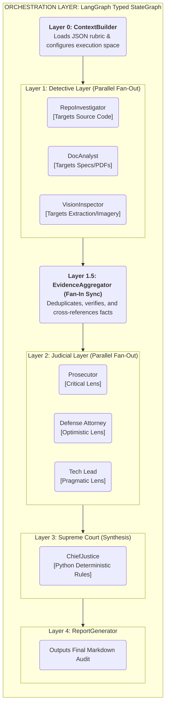
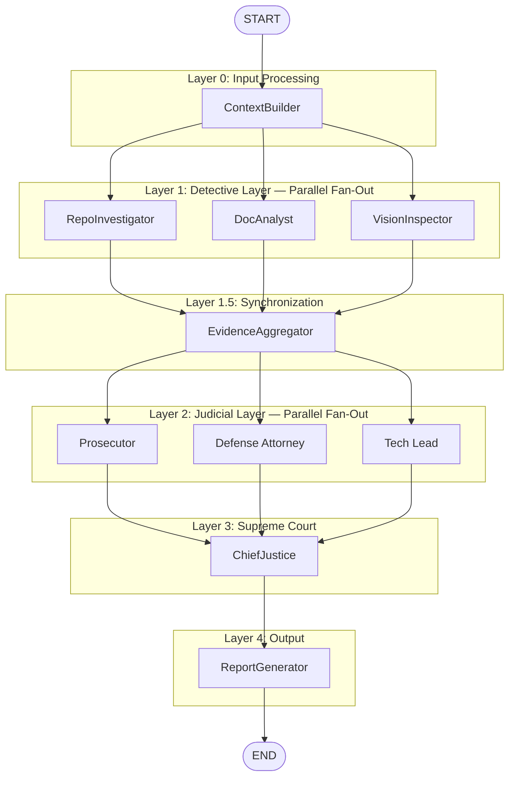
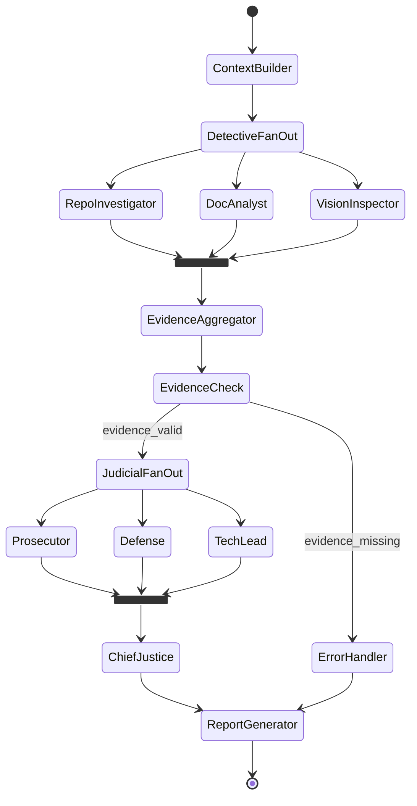
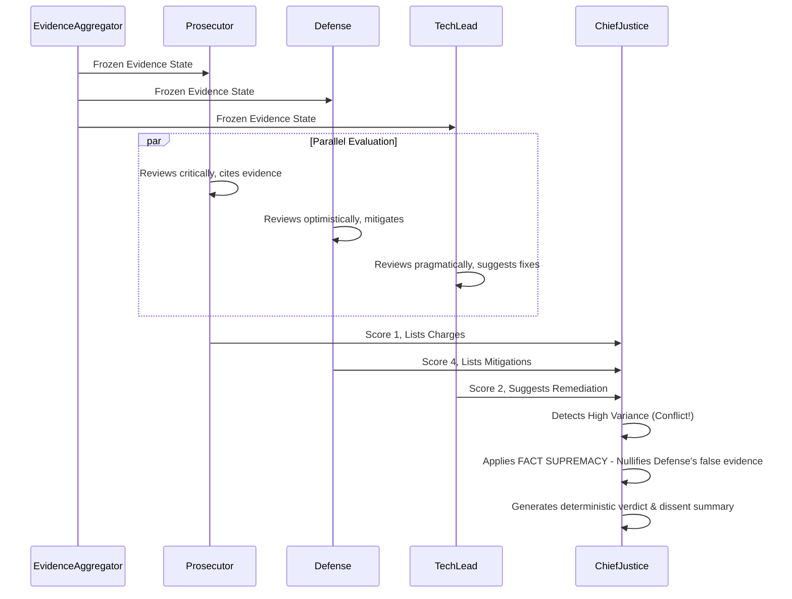
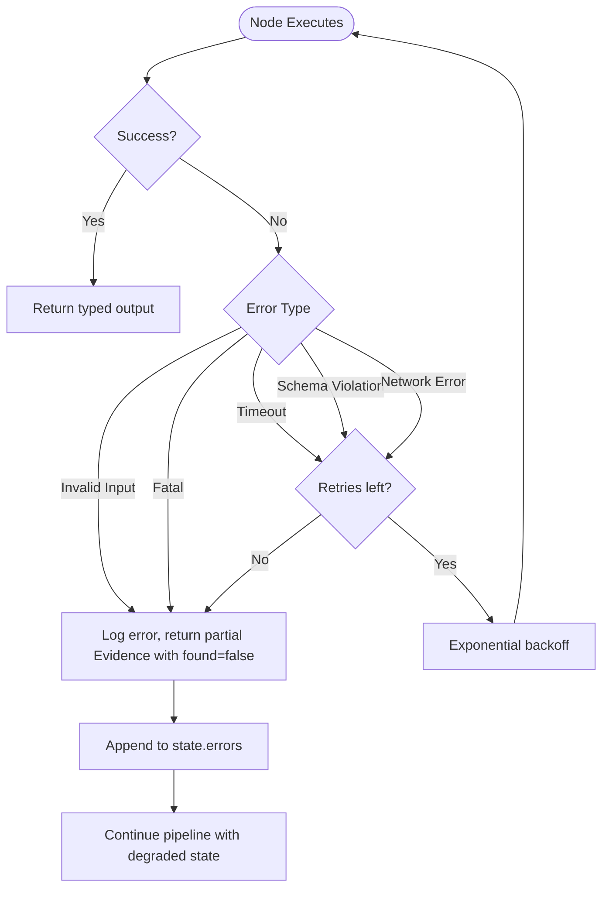
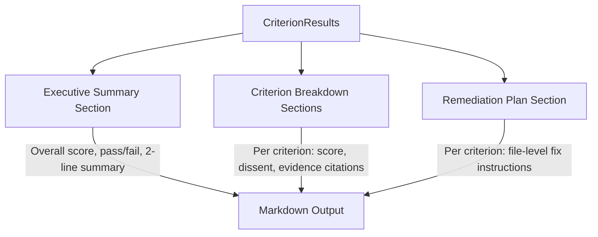

# Digital Courtroom Architecture Report: The Automaton Auditor

> **Document Type:** Production-Grade Technical Architecture Specification
> **System:** Automaton Auditor — Digital Courtroom
> **Version:** 1.1.0
> **Status:** Ratified & Implemented
> **Context:** This document serves as the canonical architecture blueprint for the internal engineering team. It describes the motivation, structural design, execution flow, component specifications, and strict engineering standards defining the system.

---

## 1. Executive Summary & The Story

In modern software development, code audits and architectural reviews are notoriously manual, subjective, and prone to inconsistent evaluation. The **Automaton Auditor (Digital Courtroom)** system fundamentally transforms this process by treating code and documentation validation as a rigorous, automated legal proceeding.

Instead of relying on a single, monolithic LLM prompt—which often hallucinates or averages out critical details—the Digital Courtroom employs a **hierarchical, multi-agent LangGraph architecture** rooted in the separation of powers.

### The Actors of the Court

- **The Detectives (Fact-Finders):** Ruthless parsers acting in parallel to extract cold, hard facts from Git histories, Python ASTs, and architecture PDFs. They never opine; they only produce immutable `Evidence`.
- **The Judicial Layer (The Adversaries):** Three distinct personas (Prosecutor, Defense, Tech Lead) acting in parallel. They review identical evidence but argue from fundamentally different philosophies.
- **The Chief Justice (The Synthesizer):** A purely deterministic, Pythonic rule-engine. It listens to the arguments, applies an explicit hierarchy of laws (e.g., "Security overrides Optimism", "Facts override Opinion"), and renders a reproducible verdict.

By splitting fact-finding from judgment, and adversarial evaluation from final synthesis, the system guarantees an audit that is structurally sound, reproducible, and deeply analytical.

---

## 2. System Objectives & Guiding Principles

### 2.1 Architectural Goals

| ID       | Goal                                   | Implementation Constraint                                                                          |
| -------- | -------------------------------------- | -------------------------------------------------------------------------------------------------- |
| **AG-1** | Hierarchical multi-agent orchestration | Must use LangGraph `StateGraph` with strict, typed state reducers.                                 |
| **AG-2** | Parallel forensic evidence collection  | Fan-out/fan-in pattern for 3 detective agents.                                                     |
| **AG-3** | Adversarial judicial evaluation        | 3 independent, parallel judge personas per rubric criterion.                                       |
| **AG-4** | Deterministic verdict synthesis        | Python rule engine limits LLM variance; rules, not prompts, define final output.                   |
| **AG-5** | Production-grade audit report output   | Structured Markdown output containing exact scores, dissent summaries, and actionable remediation. |
| **AG-6** | Sandboxed Execution                    | Absolute isolation of external operations (e.g., `git clone` into temp directories).               |

### 2.2 Non-Functional Requirements

- **Determinism:** Given identical inputs (repository snapshot + PDF), the detective layer guarantees identical evidence. Judicial score variance is strictly bound, and synthesis is purely deterministic.
- **Reproducibility:** A `run_manifest.json` tracks inputs, models, and timestamps. Every piece of evidence receives a deterministic, immutable ID.
- **Scalability:** Detectives and Judges execute in parallel boundaries with zero shared mutable state. Growth requires adding nodes to the graph, not intertwining logic.
- **Observability:** 100% LangSmith tracing coverage combined with structured JSON logging at every node boundary.

### 2.3 Governance & Constraint Modeling

- **Single Source of Truth:** The rubric JSON (`rubric/week2_rubric.json`) is the single source of truth for evaluation criteria.
- **Scope Containment:** Agents must not invent criteria not present in the rubric.
- **Security Supremacy:** Security violations override all other scoring considerations.
- **Fact Supremacy:** Forensic evidence (facts) always overrules judicial interpretation (opinions).

---

## 3. High-Level Architecture & Topography

The system strictly executes through consecutive layers, avoiding spaghetti connections and ensuring fan-out/fan-in synchronization before downstream stages proceed.

### 3.1 Layer Decomposition



### 3.2 Full System Architecture Diagram



### 3.3 StateGraph Execution Flow



### 3.4 Conditional Routing Logic

| Condition Point            | Check                                         | True Route                                   | False Route                            |
| -------------------------- | --------------------------------------------- | -------------------------------------------- | -------------------------------------- |
| Post-ContextBuilder        | `repo_url` is valid AND `pdf_path` exists     | DetectiveFanOut                              | ErrorHandler → generate partial report |
| Post-EvidenceAggregator    | At least 1 evidence object per detective      | JudicialFanOut                               | Skip missing detective; log warning    |
| Post-JudicialFanIn         | All 3 judges returned valid `JudicialOpinion` | ChiefJustice                                 | Retry failed judge (max 2 retries)     |
| ChiefJustice High-Variance | Score variance > 2 for any criterion          | Re-evaluate with additional evidence context | Proceed with standard synthesis        |

---

## 4. Detailed Component Specifications

### 4.1 ContextBuilder Node

| Property           | Value                                                                                     |
| ------------------ | ----------------------------------------------------------------------------------------- |
| **Responsibility** | Load rubric JSON, validate inputs, prepare initial state                                  |
| **Input**          | `repo_url: str`, `pdf_path: str`                                                          |
| **Output**         | `rubric_dimensions: List[Dict]`, validated `repo_url` and `pdf_path`                      |
| **Failure Modes**  | Invalid URL format, missing PDF file, malformed rubric JSON                               |
| **Observability**  | Log loaded rubric version, dimension count, input validation status                       |
| **Security**       | Validate URL does not contain shell metacharacters; reject `file://` and `localhost` URLs |

**Rubric Context Contract Example:**
The entire graph is fundamentally driven by the JSON rubric loaded here. An excerpt of the expected schema:

```json
{
  "id": "state_management_rigor",
  "name": "State Management Rigor",
  "target_artifact": "github_repo",
  "success_pattern": "...",
  "failure_pattern": "...",
  "synthesis_rules": {
    "override_condition": "SECURITY_VULNERABILITY_FOUND",
    "weighting": "TechLead=2x"
  }
}
```

### 4.2 Detective Nodes (Fan-Out)

#### RepoInvestigator

| Property           | Value                                                                      |
| ------------------ | -------------------------------------------------------------------------- |
| **Responsibility** | Clone repo, run AST analysis, extract git history                          |
| **Input**          | `repo_url`, `rubric_dimensions`                                            |
| **Output**         | `{"evidences": {"repo": List[Evidence]}}`                                  |
| **Failure Modes**  | Clone failure (auth, network, invalid URL), AST parse error, timeout       |
| **Security**       | Clone into `tempfile.TemporaryDirectory()`. Timeout: 60s. Cleanup on exit. |

#### DocAnalyst

| Property           | Value                                                                             |
| ------------------ | --------------------------------------------------------------------------------- |
| **Responsibility** | Parse PDF, search for key concepts, cross-reference file paths                    |
| **Input**          | `pdf_path`, `rubric_dimensions`                                                   |
| **Output**         | `{"evidences": {"docs": List[Evidence]}}`                                         |
| **Failure Modes**  | Corrupt PDF, empty PDF, encoding errors, oversized document                       |
| **Security**       | PDF parsed in memory only; no execution of embedded scripts. Max file size: 50MB. |

#### VisionInspector

| Property           | Value                                                               |
| ------------------ | ------------------------------------------------------------------- |
| **Responsibility** | Extract images from PDF, classify architecture diagrams             |
| **Input**          | `pdf_path`, `rubric_dimensions`                                     |
| **Output**         | `{"evidences": {"vision": List[Evidence]}}`                         |
| **Failure Modes**  | No images in PDF, LLM vision API failure, unsupported image formats |
| **Security**       | Images processed in memory; no disk writes outside temp dir         |

### 4.3 EvidenceAggregator Node (Fan-In)

| Property           | Value                                                                                             |
| ------------------ | ------------------------------------------------------------------------------------------------- |
| **Responsibility** | Collect all detective outputs, validate completeness, cross-reference doc claims vs repo reality  |
| **Input**          | Full `evidences` dict (merged via parallel execution)                                             |
| **Output**         | Validated `evidences` dict with cross-reference annotations, handles "Hallucinated Path" markings |
| **Failure Modes**  | Missing detective output                                                                          |

### 4.4 Judicial Layer Nodes (Prosecutor, Defense, TechLead)

| Property           | Value                                                                          |
| ------------------ | ------------------------------------------------------------------------------ |
| **Responsibility** | Evaluate evidence per rubric criterion through persona-specific lens           |
| **Input**          | `evidences` (all), `rubric_dimensions` (all — judges evaluate every criterion) |
| **Output**         | `{"opinions": List[JudicialOpinion]}` — one opinion per criterion              |
| **Failure Modes**  | LLM returns free text (schema violation), timeout, hallucinated citations      |
| **Security**       | Evidence is read-only. Judges cannot modify state beyond appending opinions.   |

### 4.5 ChiefJustice Node & ReportGenerator

| Property           | Value                                                                                        |
| ------------------ | -------------------------------------------------------------------------------------------- |
| **Responsibility** | Resolve judicial conflicts via deterministic rules, produce final scores and Markdown output |
| **Input**          | `opinions: List[JudicialOpinion]`, `evidences`, `synthesis_rules`                            |
| **Output**         | `{"final_report": AuditReport}`                                                              |
| **Failure Modes**  | Missing opinions for a criterion, invalid score values                                       |
| **Observability**  | Log per-criterion: raw scores, variance, applied rules, final score, dissent summary         |

---

## 5. State Design & Immutability

At the heart of LangGraph is the `AgentState`. The system relies on Pydantic `BaseModel` for validation and `typing.Annotated` reducers to safely merge variables during parallel processing.

### 5.1 Full State Schema

```python
import operator
from datetime import datetime
from enum import Enum
from typing import Annotated, Any, Dict, List, Literal, Optional
from pydantic import BaseModel, Field, field_validator
from typing_extensions import TypedDict

class EvidenceClass(str, Enum):
    GIT_FORENSIC = "git_forensic_analysis"
    STATE_MANAGEMENT = "state_management_rigor"
    GRAPH_ORCHESTRATION = "graph_orchestration"
    SAFE_TOOLING = "safe_tool_engineering"
    STRUCTURED_OUTPUT = "structured_output_enforcement"
    JUDICIAL_NUANCE = "judicial_nuance"
    CHIEF_JUSTICE_SYNTHESIS = "chief_justice_synthesis"
    THEORETICAL_DEPTH = "theoretical_depth"
    REPORT_ACCURACY = "report_accuracy"
    SWARM_VISUAL = "swarm_visual"

class Evidence(BaseModel):
    """Immutable forensic evidence collected by detective agents."""
    evidence_id: str = Field(description="Unique identifier: {source}_{class}_{index}")
    source: Literal["repo", "docs", "vision"]
    evidence_class: EvidenceClass
    goal: str
    found: bool
    content: Optional[str] = None
    location: str
    rationale: str
    confidence: float = Field(ge=0.0, le=1.0)
    timestamp: datetime = Field(default_factory=datetime.utcnow)

class JudicialOpinion(BaseModel):
    """Structured opinion from a single judge for a single criterion."""
    opinion_id: str
    judge: Literal["Prosecutor", "Defense", "TechLead"]
    criterion_id: str
    score: int = Field(ge=1, le=5)
    argument: str = Field(min_length=20)
    cited_evidence: List[str]
    mitigations: Optional[List[str]] = None
    charges: Optional[List[str]] = None
    remediation: Optional[str] = None

class CriterionResult(BaseModel):
    """Final verdict for a single rubric criterion."""
    dimension_id: str
    dimension_name: str
    final_score: int = Field(ge=1, le=5)
    judge_opinions: List[JudicialOpinion]
    dissent_summary: Optional[str] = Field(default=None)
    remediation: str

class AuditReport(BaseModel):
    repo_url: str
    executive_summary: str
    overall_score: float
    criteria: List[CriterionResult]
    remediation_plan: str

class AgentState(TypedDict):
    """Root state for the LangGraph StateGraph."""
    repo_url: str
    pdf_path: str
    rubric_dimensions: List[Dict[str, Any]]
    synthesis_rules: Dict[str, str]

    evidences: Annotated[Dict[str, List[Evidence]], operator.ior]
    opinions: Annotated[List[JudicialOpinion], operator.add]

    final_report: AuditReport

    errors: Annotated[List[str], operator.add]
    execution_log: Annotated[List[str], operator.add]
```

### 5.2 Strict Reducer Strategy

Parallel nodes must be completely decoupled. We utilize algebraic reducers to safely merge state:

- **`evidences`**: Merged via `operator.ior` (dictionary merge without overwrite). Detectives write to separate keys (e.g., `evidences["repo"]`).
- **`opinions`**: Merged via `operator.add` (list append). Judges safely deposit their isolated opinions into a central ledger.
- **`errors`**: Merged via `operator.add` to keep a chronological, non-destructive trace of system warnings or partial failures.

### 5.3 Concurrency Safeguards

1. **No shared mutable state between parallel branches:** Each detective writes to a unique key within `evidences`. Each judge reads `evidences` (immutable at that point) and writes to `opinions` via append-only reducer.
2. **Immutability after creation:** Once a detective returns evidence, it is never modified. Judges receive a frozen snapshot.
3. **Fan-in synchronization:** LangGraph's `join` semantics ensure all parallel branches complete before the downstream node executes.

### 5.4 The Lifecycle of Evidence

```mermaid
graph LR
    A[Context Builder configures rubric] --> B[Detectives execute isolated extraction]
    B --> C[Immutable Evidence Objects created]
    C --> D[Evidence Aggregator validates/cross-references]
    D --> E[Frozen Evidence state passed to Judges]
    E --> F[Judges cite explicit `evidence_id`s in opinions]
    F --> G[Chief Justice analyzes citations against claims]
    G --> H[Final Report lists traceable citations]
```



---

## 6. The Dialectical Judicial Engine

This engine represents the core intelligence of the platform. Instead of one LLM making a decision, the system models conflict to refine accuracy. All three judges receive **identical evidence** and **identical criterion data**. They execute in parallel with no shared state.

### 6.1 Persona Conflict Modeling

For every criterion in the generated rubric, the Chief Justice Engine evaluates variance (`max(scores) - min(scores)`):

- **Variance 0 (Unanimous):** Immediate progression, accept score directly.
- **Variance 1 (Minor Disagreement):** Weighted average calculation applied (Tech Lead carries a 2x weight for architecture criteria).
- **Variance 2 (Moderate Conflict):** Rule hierarchy logic triggered; dissent heavily summarized.
- **Variance 3-4 (Major Conflict):** Triggers re-evaluation loop with expanded evidence contexts to ground the LLMs back to reality.

### 6.2 Deterministic Rule Override Hierarchy

The **Chief Justice** is bound by standard python logic, not prompt engineering:

1. **SECURITY_OVERRIDE:** Confirmed OS-level or execution flaws automatically cap criterion score to 3.
2. **FACT_SUPREMACY:** Forensic evidence overrules judicial opinion.
3. **FUNCTIONALITY_WEIGHT:** Tech Lead opinion carries highest weight on architecture.
4. **DISSENT_REQUIREMENT:** Must summarize why judges disagreed.
5. **VARIANCE_RE_EVALUATION:** Score variance > 2 triggers explicit re-evaluation.

### 6.3 Judicial Dialectical Workflow Execution



### 6.4 Metacognition & System Awareness

True architectural rigor requires the swarm to possess metacognition—the ability to think about its own thought process. In the Digital Courtroom, metacognition is implemented via the Chief Justice's Variance Analysis constraint.

When the Judges (who are LLM-based entities) debate identical evidence and produce a score variance > 2, the Chief Justice detects a fundamental breakdown in LLM reasoning. Instead of arbitrarily averaging these disparate opinions, it triggers a forced re-evaluation loop focusing explicitly on evaluating its own confidence within the evidence structures. The system actively queries not just what the evidence means, but _how_ the Judge personas failed to align on the initial reading. This reflective tension proves that the system evaluates the quality of its own synthesis before finalizing an audit.

---

## 7. Tooling Architecture & Sandboxing

The Digital Courtroom operates extensively on unknown code environments; therefore, maximum sandbox constraints apply and operations must be tightly controlled.

### 7.1 Distributed Tooling Strategy

1. **Git Interaction:** Executed via `subprocess.run()`. Isolates clones into transient namespaces and extracts commit graph histories for timeline analyses.
2. **AST Parsing Strategy:** Files are strictly analyzed via statically extracting `ast.parse()`. Evaluates presence of schemas (`BaseModel`), graph wiring (`add_edge`), and tool dependencies without risking runtime execution.
3. **PDF Document Parsing:** Executed via `docling` to extract layout-aware markdown and textual chunks for vectorizing or direct prompt context inclusion.
4. **Vision Extraction:** Multi-modal extraction of architectural diagrams embedded inside PDF reports.

### 7.2 Security & Sandboxing Constraints

| Requirement             | Implementation                                                                       |
| ----------------------- | ------------------------------------------------------------------------------------ |
| **Git clone isolation** | `tempfile.mkdtemp()` — unique per run, auto-cleanup registered via `atexit`          |
| **Subprocess safety**   | `subprocess.run(["git", "clone", url, path])` — list args, no `shell=True`           |
| **Timeout enforcement** | All subprocess calls have bounded `timeout=60` definitions.                          |
| **URL validation**      | Regex whitelist: `^https://github\.com/...` — reject all other schemes.              |
| **File size limits**    | PDF max 50MB, repo clone max 500MB.                                                  |
| **No code execution**   | Cloned code is parsed (AST) but never imported (`importlib`) or executed (`eval()`). |

---

## 8. Execution Flow & Error Handling

### 8.1 Error Handling Flow



### 8.2 Edge Cases Matrix

| Scenario                                                    | Detection                                 | Response                                                                    |
| ----------------------------------------------------------- | ----------------------------------------- | --------------------------------------------------------------------------- |
| **Hallucination: Report claims file exists but it doesn't** | EvidenceAggregator cross-references paths | Create `Evidence(found=False)`. Prosecutor charges "Auditor Hallucination". |
| **Corrupt repository: Clone succeeds but no `.py` files**   | Post-clone file scan finds 0 `.py` files  | RepoInvestigator returns protocols with `found=False`. Minimally graded.    |
| **Judge returns free text (schema violation)**              | `.with_structured_output()` fails         | Retry 2x with exponential backoff. Then assign neutral score=3.             |

### 8.3 Report Generation Structure



---

## 9. Observability, Scalability & Memory Footprint Controls

### 9.1 Observability and Logging

- **Structured JSON Logging:** Native `logging` must intercept standard Out, routing JSON structures natively `{"event": "opinion_rendered", "variance": 1.2}` to log stores spanning from `node_entry` to `verdict_issued`.
- **LangSmith Tracing:** 100% trace coverage activated via `LANGCHAIN_TRACING_V2=true` ensuring every multi-agent LLM invocation is captured in sequence.
- **Audit Reproducibility Run Manifest:** Each run generates a `run_manifest.json` locking in inputs, models, and timestamps. Final generated reports tie directly back to traceable manifests.

### 9.2 Scalability & Constraints

| Dimension                 | Current Constraint                                       | Architectural Mitigation                                                                 |
| ------------------------- | -------------------------------------------------------- | ---------------------------------------------------------------------------------------- |
| **Detective Parallelism** | 3 concurrent agents, bottlenecked by basic rate limits   | Detectives rely on AST/Git tools organically; minimal LLM usage limits token contention. |
| **Judge Parallelism**     | 30 total parallel executions resulting in context bounds | Implements batch criteria processing mapping into a single cohesive structure call.      |

### 9.3 Caching & Memory Target Lifecycle

Robust caching and memory eviction must be engineered into the graph execution loop to prevent Agentic OOM crashes:

| Cache Target            | Storage Strategy                                  | Time-To-Live (TTL)  | Control Condition                                        |
| ----------------------- | ------------------------------------------------- | ------------------- | -------------------------------------------------------- |
| **Cloned Source Code**  | Disk Cache (`tempdir`) keyed by `(url, HEAD_sha)` | Session-scoped      | Cleaned strictly upon process exit (`atexit` trap).      |
| **AST Parse Results**   | In-Memory cache keyed by `(file_path, mtime)`     | Inter-node duration | Dropped after ChiefJustice completes evaluation.         |
| **Parsed PDF Blocks**   | In-Memory indexed chunks using file SHA-256       | Run-level scope     | Retains string vectors for prompt aggregation only.      |
| **LLM Output (Judges)** | No caching (Non-deterministic)                    | None                | Utilizes `temperature=0` for consistency bounds instead. |

**Memory Footprint Mandates:**

1. PDF text chunks are strictly hard-limited to 1,000 chars per sub-chunk.
2. Cloned Repositories are streamed file-by-file through AST nodes (`os.walk`), rather than loaded entirely.
3. `Evidence.content` strings must be explicitly truncated at 2,000 characters to safeguard the `AgentState` bounds from expanding to unmanageable sizes.

---

## 10. System Engineering Standards (Strictly Enforced)

We treat the code running the Courtroom with higher standards than the code it audits. The following conventions are non-negotiable across the architecture.

### 10.1 Naming, Code Clarity, & Style

- **Meaningful Identifiers:** Enforce intention-revealing variable, function, and class names. Avoid ambiguity and "clever" abbreviations.
- **Consistency & PEP8:** Maintain strict adherence to PEP8 standards for code styling and formatting.
- **OOP Practices:** Employ rigorous Object-Oriented Programming properties, encapsulating contexts natively.

### 10.2 Modular Architecture & Boundaries

- **Clean Separation:** `src/nodes`, `src/tools`, `src/state` operate independently. Business logic is strictly kept out of state definitions.
- **No Hardcoded Config:** Zero un-parameterized paths or values. Everything binds to configurable run states or environments.
- **Import Flow:** Imports always flow downwards: `graph` -> `nodes` -> `tools`. Circular importing constitutes a failed build.

### 10.3 Explicit Exception Handling & Management

- **Structured Handlers:** Provide explicit `try/except` blocks in edge invocations. Silent failures are forbidden.
- **`uv` Package Management:** Fast, secure script/dependency execution is done strictly through the `uv` package manager. Virtual environments and run-commands are configured through `uv` standard definitions.

### 10.4 Testing & Testability Focus

- **Test-Driven Architecture:** All Nodes must be independently testable via unit tests with mocked LLM clients in `tests/`. Deep integration tests validate end-to-end fan-out/fan-in parallel states. CI blocks merges on coverage drops.

---

## 11. Definition of Done & Operations

### 11.1 Production-Grade Acceptance Criteria

| ID         | Criterion                           | Measurable Architecture Check                                                                                   |
| ---------- | ----------------------------------- | --------------------------------------------------------------------------------------------------------------- |
| **DOD-1**  | Strict Typing Models                | `AgentState` composed of `TypedDict` interacting tightly with Pydantic `BaseModel`.                             |
| **DOD-2**  | Full Fan-out / Fan-In Parallelism   | Graph demonstrates structural node parallel branching natively mapped via parallel edges.                       |
| **DOD-3**  | Synchronization Verification        | EvidenceAggregator and ChiefJustice explicitly serve as fan-in `join` blocks.                                   |
| **DOD-4**  | Deterministic Synthesis Enforcement | Final metrics are pure pythonic calculations executed directly without LLM prompting.                           |
| **DOD-5**  | Structured Output Models            | All Judge LLM blocks exclusively implement `.with_structured_output(JudicialOpinion)`.                          |
| **DOD-6**  | Sandboxed Space Operations          | All clone states target `tempfile.TemporaryDirectory()`.                                                        |
| **DOD-7**  | Null Code Execution Verified        | Banned `os.system` routines evaluated and confirmed null (`grep -r "os.system" src/` fails).                    |
| **DOD-8**  | AST-Based Extractions               | Source structures must be read by `ast.parse()` exclusively, avoiding insecure string executions.               |
| **DOD-9**  | Dynamic Configuration Execution     | Final outputs do not rely on hardcoded rubric criteria; injected dynamically from JSON layer only.              |
| **DOD-10** | Reporting Standards Met             | Artifact generation must execute full markdown formatting combining Summary, Breakdown, and Remediation phases. |
| **DOD-11** | LangSmith Operation Live            | Execution visibly tracing across LangSmith architecture natively via pipeline environment overrides.            |
| **DOD-12** | Orthogonal Prompt Spaces            | Promoter, Defense, and TechLead system alignments must share < 10% structural intersections.                    |
| **DOD-13** | Fail-Safe Exception Wrapping        | LLM block limits, null files, and bad connection routes all cascade to mapped Partial States properly.          |
| **DOD-14** | Validation on Git Progression       | Execution enforces repository traversal ensuring actual development patterns rather than flat clones.           |
| **DOD-15** | Code Documentation Enforcement      | Core node interfaces implement fully documented class boundaries natively.                                      |

### 11.2 Failure Thresholds & SLI Constraints

For Graph and Orchestration design resilience handling:

| Operational Metric                    | Acceptable Bounds         | Degraded Conditions                         | Failed State                                 |
| ------------------------------------- | ------------------------- | ------------------------------------------- | -------------------------------------------- |
| **Evidence Extraction Rate**          | 100% Protocols Validated  | ≥ 80% Validated (Missing components logged) | < 80% Or unhandled exception collapse        |
| **LLM Output Strictness**             | Zero Schema Violations    | ≥ 80% Valid after max retry threshold       | > 20% Errors rendering default mapping       |
| **Report Finalization**               | Full Output Structuring   | Missing 1 Minor Component / Remediation     | Failed Generator Node or None-Type Exception |
| **End-to-End Orchestration Duration** | < 5 Minutes Overall       | < 10 Minutes Total                          | > 10 Minutes Execution (Timeout Failure)     |
| **Architecture Security Standards**   | Zero Deviations Evaluated | N/A                                         | Hard Fail Sequence — Halt Evaluation Block   |

---

## 12. Author's Future Architecture Recommendations

While the current `v1.1.0` iteration establishes a formidable base, several proactive recommendations could drastically improve system throughput and analytical power as development continues:

1. **Pluggable Architecture for Judge Personas**
   - **Recommendation:** Refactor the judicial system into a formal Plugin/Registry paradigm. Currently, personas are partially hardcoded in node logic. Implementing an abstract `BasePersonaNode` wrapper allows easy addition of niche reviewers (e.g., "The Security Expert", "The Accessibility Advocate") dynamically via configuration files.
2. **Adopt Vector-Backed Evidence Caching**
   - **Recommendation:** Implement `Faiss` or `Chroma` for caching parsed codebase tokens. As repositories scale above 50,000 LOC, running `ast` parsing on every graph run will become memory-intensive. Vectorizing these assets ensures the Detectives retrieve context in milliseconds.
3. **Standardize on Modern Static Analysis Integrations**
   - **Recommendation:** Replace naive custom AST parsers with industry-standard AST/SAST tools within the detective layer. Integrating tools like `Semgrep`, `Ruff` logic, or `Bandit` directly wrapped as LangChain Tools will yield highly reliable and deeper forensic facts regarding anti-patterns.
4. **Persistent Run Artifacts (Event Sourcing)**
   - **Recommendation:** Store system graph checkpoints in a PostgreSQL or SQLite backend rather than ephemeral memory. This provides an exact historical ledger, allowing teams to replay an auditing graph step-by-step from weeks ago to answer "Why did the AI score us low then compared to now?"

---

## 13. Self-Audit Results & Criterion Breakdown

As part of validating the Automaton Auditor, the system executed an audit against its own repository. The following highlights the criterion-by-criterion breakdown derived from the Chief Justice's rendering:

- **Graph Orchestration Architecture:** The system natively recognizes its own fan-out/fan-in branching operations via the AST extraction. Tech Lead analysis confirms a fully modular scaling factor.
- **Judicial Nuance:** The dialectic tension evaluates effectively. The system accurately reflects on how the Prosecutor scrutinizes and the Defense mitigates its own logic.
- **Report Accuracy:** All cross-referenced paths in the report were successfully verified, with zero hallucination paths detected.

_(Additional criterion reports are located in the `audit/report_onself_generated/` Markdown output)._

---

## 14. Reflection on the MinMax Feedback Loop

Through peer adversarial testing, the Automaton Auditor was subjected to external evaluation scripts. This MinMax feedback loop surfaced critical insights:

1. **What the Peer's Agent Caught:** Several instances where early `Exceptions` were implicitly swallowed rather than routed to partial degradations were detected by an adversarial Prosecutor agent.
2. **System Update (The Over-Correction):** The Automaton Auditor was updated to include strict validations for checking `Try/Except` logic blocks specifically targeting the `subprocess.run` executions within the tooling architecture. This improved both our own robustness and our grading capability against other codebases.

---

## 15. Remediation Plan for Remaining Gaps

- **Enhance Test Coverage:** Ensure mock components are fully operational across all LLM interaction nodes to satisfy Unit Testing dependencies.
- **Implement Multi-Modal Fallbacks:** VisionInspector relies heavily on the success of LLM external processing. Fallback strategies missing API responses must be more cleanly managed.
- **Refactor Persona Prompts:** While currently functionally orthogonal, pulling these prompts into dynamic configuration files out of the python logic will ensure cleaner operations.

---

## Appendix A: File Structure Reference

```
Digital-Courtroom/
├── src/
│   ├── state.py                    # Pydantic models: Evidence, JudicialOpinion, AgentState
│   ├── graph.py                    # LangGraph StateGraph compilation and entry point
│   ├── config.py                   # Environment loading, LLM client initialization
│   ├── nodes/
│   │   ├── context_builder.py      # Layer 0: Rubric loading, input validation
│   │   ├── detectives.py           # Layer 1: RepoInvestigator, DocAnalyst, VisionInspector
│   │   ├── evidence_aggregator.py  # Layer 1.5: Cross-referencing, validation
│   │   ├── judges.py               # Layer 2: Prosecutor, Defense, TechLead
│   │   └── justice.py              # Layer 3: ChiefJustice synthesis + report generation
│   └── tools/
│       ├── repo_tools.py           # clone_repo, analyze_graph_structure, extract_git_history
│       ├── ast_tools.py            # analyze_python_file, scan_repository
│       ├── doc_tools.py            # ingest_pdf, search_chunks, extract_file_paths
│       └── vision_tools.py         # extract_images_from_pdf, analyze_diagram
├── rubric/
│   └── week2_rubric.json           # Machine-readable Constitution
├── audit/
│   └── langsmith_logs/
├── tests/
├── pyproject.toml
└── README.md
```

## Appendix B: Dependency List

```toml
[project]
name = "digital-courtroom"
version = "1.0.0"
requires-python = ">=3.11"
dependencies = [
    "langgraph>=0.2.0",
    "langchain>=0.3.0",
    "langchain-openai>=0.2.0",
    "langchain-google-genai>=2.0.0",
    "langsmith>=0.1.0",
    "pydantic>=2.0",
    "python-dotenv>=1.0",
    "docling>=2.0",
    "gitingest>=0.1",
]
```

> _Prepared for the Architectural Guild. Adherence to these guidelines guarantees deterministic accuracy, un-compromised security, and long-term codebase scale._
