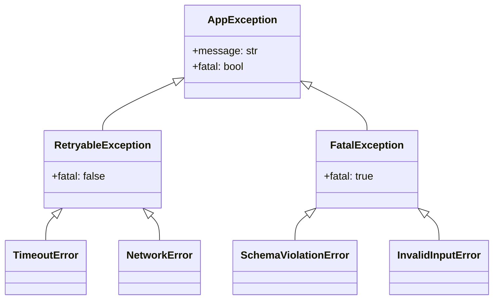

# Data Model: Observability and Error Handling

## Log Schemas

### StructuredLogRecord

The schema for all JSON logs emitted by `StructuredLogger`.

| Field        | Type             | Description                                                     |
| ------------ | ---------------- | --------------------------------------------------------------- |
| `timestamp`  | `ISO8601 String` | UTC time of execution.                                          |
| `event_type` | `String`         | Unique identifier for the lifecycle point (e.g., `node_entry`). |
| `severity`   | `String`         | One of `DEBUG`, `INFO`, `WARNING`, `ERROR`, `CRITICAL`.         |
| `node_name`  | `String`         | Name of the active LangGraph node (if applicable).              |
| `message`    | `String`         | Human-readable context.                                         |
| `payload`    | `Dict`           | Event-specific metadata (redacted).                             |

## Exception Hierarchy

## Tracing Configuration

| Env Variable           | Type     | Default              | Description                           |
| ---------------------- | -------- | -------------------- | ------------------------------------- |
| `LANGCHAIN_TRACING_V2` | `bool`   | `false`              | Global toggle for LangSmith tracing.  |
| `LANGCHAIN_API_KEY`    | `string` | `None`               | Authentication for LangSmith service. |
| `LANGCHAIN_PROJECT`    | `string` | `"digital-court_v1"` | Destination project for traces.       |
| `LOG_LEVEL`            | `string` | `"INFO"`             | Global logging verbosity.             |
