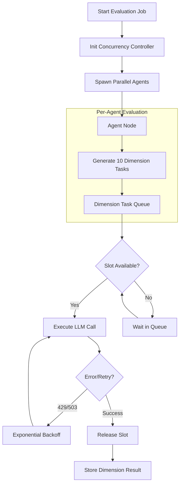

# Feature Specification: Bounded-Concurrency Multi-Agent Evaluation

**Feature Branch**: `012-bounded-agent-eval`  
**Created**: 2026-02-26  
**Status**: Draft  
**Input**: Bounded-Concurrency Multi-Agent Evaluation Refactor - Redesign architecture to eliminate uncontrolled fan-out and enable safe, scalable concurrent execution.

## Context & Problem Analysis

The current evaluation architecture executes 3 agents, each evaluating 10 dimensions independently. This results in an uncontrolled fan-out of 30 parallel LLM calls. This design leads to:

1. **Provider Saturation**: Exceeding rate limits (429 errors).
2. **Resource Exhaustion**: Unbounded `asyncio.gather` calls.
3. **Fragility**: High probability of task failure under load.

The refactor introduces a bounded concurrency model to ensure that total parallel LLM calls are explicitly limited, regardless of the number of agents or dimensions.

## Execution Flow (Refactored)

## User Scenarios & Testing

### User Story 1 - Stable Parallel Evaluation (Priority: P1)

As a system operator, I want to run multi-agent evaluations without encountering rate-limit failures, even when agents are running concurrently.

**Why this priority**: Essential for production reliability and preventing data loss from failed evaluations.

**Independent Test**: Run an evaluation with 3 agents and 10 dimensions each. Configure concurrency to 5. Verify that the total number of "in-flight" LLM calls never exceeds 5 and all 30 dimensions are successfully processed.

**Acceptance Scenarios**:

1. **Given** a concurrency limit of 5, **When** 30 evaluation requests are triggered, **Then** exactly 5 calls are active simultaneously until completion.
2. **Given** a 429 error from the LLM provider, **When** the request fails, **Then** the system automatically retries with increasing delays.

---

### User Story 2 - Performance Optimization (Priority: P2)

As a developer, I want to configure the concurrency ceiling based on different provider quotas so I can maximize throughput for different models.

**Why this priority**: Allows adapting to different infrastructure constraints (e.g., local Ollama vs. OpenAI tier 1 vs. tier 5).

**Independent Test**: Modify `MAX_CONCURRENT_LLM_CALLS` and observe that total job duration scales inversely with the limit (up to a point).

**Acceptance Scenarios**:

1. **Given** updated configuration settings, **When** the system starts, **Then** it respects the new concurrency boundaries immediately.

---

### User Story 3 - Structured Evaluation Batching (Priority: P3)

As a user, I want the option to consolidate dimension evaluations into single structured calls per agent to further reduce overhead.

**Why this priority**: Reduces the absolute number of requests, lowering costs and latency if the model supports it.

**Independent Test**: Toggle "Batching Mode" and verify that 1 requested agent evaluation results in a single structured LLM call containing all 10 dimensions.

**Acceptance Scenarios**:

1. **Given** "Batching Mode" is enabled, **When** an agent begins evaluation, **Then** it sends one prompt for all dimensions instead of 10 individual prompts.

---

## Requirements

### Functional Requirements

- **FR-001**: System MUST enforce a strictly bounded **Global Concurrency Limit** on the total number of outstanding LLM requests across all agents. The limit N represents the absolute ceiling for simultaneous network requests to the LLM backend.
- **FR-002**: System MUST implement a retry mechanism with exponential backoff for transient provider failures (e.g., 429 Rate Limit, 502/503 Gateway errors).
- **FR-003**: System MUST provide a centralized configuration interface for `MAX_CONCURENT_LLM_CALLS`.
- **FR-004**: System MUST be architecture-agnostic, supporting any LLM backend (Ollama, OpenAI, Anthropic, etc.) through a unified concurrency bridge.
- **FR-005**: System MUST support "Structured Batching" where 10 dimensions are grouped into a single structured output request to minimize call volume.
- **FR-006**: System MUST degrade gracefully, increasing job duration instead of failing when the concurrency limit is reached.

### Key Entities

- **Concurrency Controller**: The central manager (Semaphore or Task Queue) responsible for throttling requests.
- **Evaluation Task**: A single unit of work (one dimension evaluation or one agent batch).
- **Retry Policy**: The configuration defining backoff multipliers, jitter, and maximum retry attempts.

### Edge Cases

- **Zero-Width Bound**: What happens if the concurrency limit is set to 0 or a negative number? (System MUST default to 1 or throw error).
- **Persistent Failures**: How does the system handle an LLM that is down permanently? (System MUST reach a maximum retry count and fail gracefully).
- **Hung Requests**: How does the system handle requests that never return? (System MUST implement timeouts for each dimension evaluation).

## Assumptions and Dependencies

- **Assumptions**:
  - Users have valid API keys for their chosen providers.
  - Large-scale evaluations (e.g., 100+ agents) are not expected in this phase, but the design should theoretically support them.
- **Dependencies**:
  - Requires an LLM provider that supports either concurrent requests or structured output for batching.

## Success Criteria

- **SC-001**: **Zero 429 Errors**: Benchmarked evaluations of 3 agents x 10 dimensions must complete with zero rate-limit failures under standard provider quotas.
- **SC-002**: **Predictable Load**: The number of concurrent network requests MUST NOT exceed the user-defined limit at any timestamp.
- **SC-003**: **Observability**: System logs must clearly indicate when requests are being throttled or retried due to concurrency bounds.
- **SC-004**: **Scalability**: The design must allow increasing the number of agents without a corresponding linear increase in parallel network requests.
