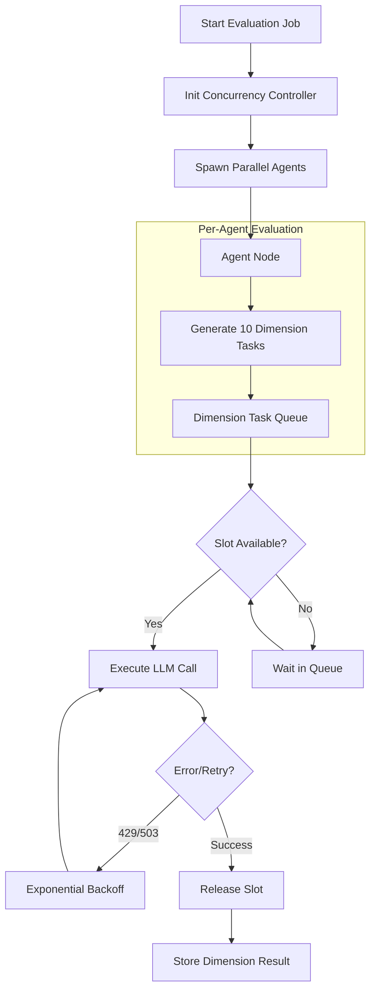

# Feature Specification: Bounded-Concurrency Multi-Agent Evaluation

**Feature Branch**: `012-bounded-agent-eval`  
**Created**: 2026-02-26  
**Status**: Draft  
**Input**: Bounded-Concurrency Multi-Agent Evaluation Refactor - Redesign architecture to eliminate uncontrolled fan-out and enable safe, scalable concurrent execution.

## Context & Problem Analysis

The current evaluation architecture executes 3 agents, each evaluating 10 dimensions independently. This results in an uncontrolled fan-out of 30 parallel LLM calls. This design leads to:

1. **Provider Saturation**: Exceeding rate limits (429 errors).
2. **Resource Exhaustion**: Unbounded `asyncio.gather` calls.
3. **Fragility**: High probability of task failure under load.

The refactor introduces a bounded concurrency model to ensure that total parallel LLM calls are explicitly limited, regardless of the number of agents or dimensions.

## Clarifications

### Session 2026-02-26

- Q: What are the specific parameters for the exponential backoff (Initial delay and Maximum delay)? → A: Standard: Initial 1s → Exp. Max 60s (with jitter).
- Q: Which specific mechanism should be used to enforce the global concurrency limit? → A: Semaphore: Use `asyncio.Semaphore` for direct throttling.
- Q: When using Structured Batching, how should validation be handled if the model fails to return evaluations for all 10 dimensions in the single call? → A: Partial Success: Accept returned items, retry missing ones separately.
- Q: Where should the concurrency and retry settings be stored? → A: Environment Variables: Primary source, e.g., in `.env`.
- Q: What level of detail should the concurrency logging include by default? → A: Standard: Log "Queueing" and "Acquired" events.

## Execution Flow (Refactored)

## User Scenarios & Testing

### User Story 1 - Stable Parallel Evaluation (Priority: P1)

As a system operator, I want to run multi-agent evaluations without encountering rate-limit failures, even when agents are running concurrently.

**Why this priority**: Essential for production reliability and preventing data loss from failed evaluations.

**Independent Test**: Run an evaluation with 3 agents and 10 dimensions each. Configure concurrency to 5. Verify that the total number of "in-flight" LLM calls never exceeds 5 and all 30 dimensions are successfully processed.

**Acceptance Scenarios**:

1. **Given** a concurrency limit of 5, **When** 30 evaluation requests are triggered, **Then** exactly 5 calls are active simultaneously until completion.
2. **Given** a 429 error from the LLM provider, **When** the request fails, **Then** the system automatically retries with increasing delays.

---

### User Story 2 - Performance Optimization (Priority: P2)

As a developer, I want to configure the concurrency ceiling based on different provider quotas so I can maximize throughput for different models.

**Why this priority**: Allows adapting to different infrastructure constraints (e.g., local Ollama vs. OpenAI tier 1 vs. tier 5).

**Independent Test**: Modify `MAX_CONCURRENT_LLM_CALLS` and observe that total job duration scales inversely with the limit (up to a point).

**Acceptance Scenarios**:

1. **Given** updated configuration settings, **When** the system starts, **Then** it respects the new concurrency boundaries immediately.

---

### User Story 3 - Structured Evaluation Batching (Priority: P3)

As a user, I want the option to consolidate dimension evaluations into single structured calls per agent to further reduce overhead.

**Why this priority**: Reduces the absolute number of requests, lowering costs and latency if the model supports it.

**Independent Test**: Toggle "Batching Mode" and verify that 1 requested agent evaluation results in a single structured LLM call containing all 10 dimensions.

**Acceptance Scenarios**:

1. **Given** "Batching Mode" is enabled, **When** an agent begins evaluation, **Then** it sends one prompt for all dimensions instead of 10 individual prompts.

---

## Requirements

### Functional Requirements

- **FR-001**: System MUST enforce a strictly bounded **Global Concurrency Limit** on the total number of outstanding LLM requests across all agents. The limit N (default: **5**, valid range: **1–50**) represents the absolute ceiling for simultaneous network requests to the LLM backend. If N is set to 0 or a negative number, the system MUST raise a `ValueError` at startup.
- **FR-002**: System MUST implement a retry mechanism with **true exponential backoff** for transient provider failures. Retryable HTTP status codes: **429** (Rate Limit), **502** (Bad Gateway), **503** (Service Unavailable), **408** (Request Timeout). The backoff formula is: `delay = min(initial_delay * 2^(attempt-1) + random_jitter, max_delay)` where `initial_delay=1s`, `max_delay=60s`, `max_attempts=3`, and `jitter` is a random value in `[0, 0.5s]` to prevent thundering-herd synchronization.
- **FR-003**: System MUST provide a centralized configuration interface via the following **environment variables** (read from `.env`):
  - `MAX_CONCURRENT_LLM_CALLS` (int, default: 5) — Global semaphore limit.
  - `RETRY_INITIAL_DELAY` (float, default: 1.0) — Initial backoff delay in seconds.
  - `RETRY_MAX_DELAY` (float, default: 60.0) — Maximum backoff cap in seconds.
  - `RETRY_MAX_ATTEMPTS` (int, default: 3) — Maximum retry attempts per request.
  - `BATCHING_ENABLED` (bool, default: false) — Toggle for structured batching mode.
  - `LLM_CALL_TIMEOUT` (float, default: 120.0) — Per-request timeout in seconds.
- **FR-004**: System MUST be architecture-agnostic, supporting any LLM backend (Ollama, OpenAI, Anthropic, etc.) through a unified concurrency bridge. Providers that do not support structured output MUST fall back to individual-dimension calls even if `BATCHING_ENABLED=true`.
- **FR-005**: System MUST support "Structured Batching" where dimensions are grouped into a single structured output request conforming to the JSON schema defined in `data-model.md § Batching Contract`. If a batched response is incomplete (missing `criterion_id` entries), the system MUST accept the valid dimensions and automatically retry missing dimensions individually. If a batched response contains **malformed or corrupt entries** (unparseable JSON, schema violations), the system MUST discard those entries, log a WARNING with the raw content, and retry them as individual dimension calls.
- **FR-006**: System MUST degrade gracefully, increasing job duration instead of failing when the concurrency limit is reached.
- **FR-007**: The semaphore MUST be released in **all exit paths**: successful completion, caught exceptions, and timeouts. This MUST be enforced via `async with` context manager or an equivalent `try/finally` block.
- **FR-008**: Each individual LLM call MUST be wrapped in a timeout of `LLM_CALL_TIMEOUT` seconds (default: 120s). If the timeout expires, the call MUST be cancelled, the semaphore slot released, and the dimension retried according to the standard retry policy.
- **FR-009**: The concurrency limit `MAX_CONCURRENT_LLM_CALLS` MUST NOT be modified during an active evaluation job. Changes to this value take effect only on the next job invocation. The system MUST log an INFO message at job start confirming the active concurrency limit.

### Key Entities

- **Concurrency Controller**: The central manager using an `asyncio.Semaphore` to strictly throttle parallel requests.
- **Evaluation Task**: A single unit of work (one dimension evaluation or one agent batch).
- **Retry Policy**: The configuration defining backoff multipliers, jitter, and maximum retry attempts.

### Edge Cases

- **Zero-Width Bound**: If `MAX_CONCURRENT_LLM_CALLS` is set to 0 or a negative number, the system MUST raise a `ValueError` at startup with the message: `"MAX_CONCURRENT_LLM_CALLS must be >= 1, got {value}"`.
- **Persistent Failures**: After exhausting all 3 retry attempts, the system MUST log an ERROR with the dimension ID, agent name, last HTTP status code, and elapsed time. It MUST then record a `JudicialOpinion` with `score=None` and `argument="Evaluation failed after 3 retries"` and append the error to `state.errors`. The pipeline MUST continue processing remaining dimensions.
- **Hung Requests**: Each LLM call MUST be wrapped in `asyncio.wait_for` with a timeout of `LLM_CALL_TIMEOUT` seconds (default: 120s). If the timeout fires, the call MUST be cancelled, an `asyncio.TimeoutError` logged at WARNING level, and the dimension retried per FR-002.
- **Corrupt Batch Response**: If a batched LLM response contains entries that fail Pydantic schema validation, those entries MUST be discarded, logged at WARNING with the raw payload, and retried individually.

## Assumptions and Dependencies

- **Assumptions**:
  - Users have valid API keys for their chosen providers.
  - Large-scale evaluations (e.g., 100+ agents) are not expected in this phase, but the design should theoretically support them.
- **Dependencies**:
  - Requires an LLM provider that supports either concurrent requests or structured output for batching.

## Success Criteria

- **SC-001**: **Zero 429 Errors**: Benchmarked evaluations of 3 agents x 10 dimensions must complete with zero rate-limit failures under standard provider quotas. Measurement: Parse structured logs for any entry with `"status_code": 429` that was not subsequently resolved by a retry; count MUST be 0.
- **SC-002**: **Predictable Load**: The number of concurrent network requests MUST NOT exceed the user-defined limit at any point during execution. Measurement: Count log entries where `"event": "acquired"` minus `"event": "released"` at any timestamp; the delta MUST never exceed `MAX_CONCURRENT_LLM_CALLS`.
- **SC-003**: **Observability**: System logs MUST emit structured JSON events with the following formats:
  - **Queueing**: `{"event": "queueing", "agent": "<name>", "dimension": "<id>", "queue_depth": <int>}`
  - **Acquired**: `{"event": "acquired", "agent": "<name>", "dimension": "<id>", "active_slots": <int>}`
  - **Released**: `{"event": "released", "agent": "<name>", "dimension": "<id>", "active_slots": <int>}`
  - **Retry**: `{"event": "retry", "agent": "<name>", "dimension": "<id>", "attempt": <int>, "status_code": <int>, "delay_s": <float>}`
  - **Timeout**: `{"event": "timeout", "agent": "<name>", "dimension": "<id>", "timeout_s": <float>}`
- **SC-004**: **Scalability**: The design must allow increasing the number of agents without a corresponding linear increase in parallel network requests.
