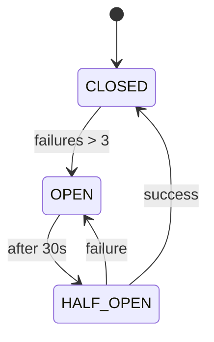

# Data Model: Operation Ironclad Swarm — Production-Grade Hardening

## Entities

### HardenedConfig (Pydantic Model)

- **Purpose**: Centralized storage for all swarm configuration derived from environment and vault.
- **Fields**:
  - `models: Dict[str, str]` (e.g., {"evaluator": "gpt-4o"})
  - `endpoints: Dict[str, str]`
  - `timeouts: Dict[str, int]` (Default seconds)
  - `vault_secrets: Dict[str, SecretStr]` (Sensitive tool credentials)
- **Validation**:
  - All model names must be non-empty.
  - Timeouts must be between 1 and 300 seconds.

### CircuitBreakerState (Pydantic Model)

- **Purpose**: Tracks the health of external API integrations.
- **Fields**:
  - `resource_name: str` (e.g., "GitHubAPI")
  - `status: Enum[CLOSED, OPEN, HALF_OPEN]`
  - `failure_count: int`
  - `last_failure_time: Optional[datetime]`
  - `open_until: Optional[datetime]`

### EvidenceChain (Pydantic Model)

- **Purpose**: Cryptographic linkage for forensic integrity.
- **Fields**:
  - `chain_id: UUID`
  - `previous_hash: str` (SHA-256)
  - `evidence_id: str`
  - `content_hash: str` (SHA-256 of the current evidence contents)
  - `aggregate_hash: str` (SHA-256(previous_hash + content_hash))

### DashboardInteraction (Internal)

- **Purpose**: Controls for real-time TUI engagement.
- **Commands**: `PAUSE`, `RESUME`, `RESET_CB`.

### SandboxEnvironment (Pydantic Model)

- **Purpose**: Configuration and metadata for ephemeral execution.
- **Fields**:
  - `root_path: Path` (Ephemeral directory)
  - `memory_limit_mb: int` (Default: 512)
  - `cpu_limit_cores: int` (Default: 1)
  - `timeout_seconds: int` (Default: 60)

### TraceAuditTrail (Pydantic Model / JSON Schema)

- **Purpose**: Structured log for LangSmith export.
- **Fields**:
  - `node_name: str`
  - `input_state_hash: str`
  - `output_state_hash: str`
  - `tool_calls: List[Dict]` (Sanitized inputs/outputs)
  - `latency_ms: float`

## State Transitions (Circuit Breaker)

