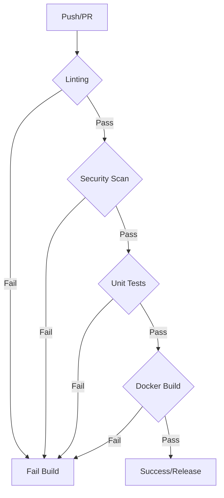

# Data Model: DevOps Hardening

## Infrastructure Entities

### OCI Build Artifact (Docker Image)

- **Name**: `digital-courtroom`
- **Tag**: `latest` (local) / `sha-{short-sha}` (CI)
- **User Context**: `courtroom_user` (UID 1000)
- **Workdir**: `/app`
- **Exposed Volumes**:
  - `/app/audit`: Persists evidence chains and reports.
  - `/app/reports`: Read-only source for audit targets (PDFs).

### GitHub Actions Environment

- **Contexts**: `os`, `python-version`, `uv-version`.
- **Secrets Mapping**:
  - `LANGCHAIN_API_KEY`: Required for tracing.
  - `COURTROOM_VAULT_KEY`: Required for encrypted secret access.

## Volume Mappings & State Transitions

| Target         | Host Source | Purpose                   | Permissions |
| -------------- | ----------- | ------------------------- | ----------- |
| `/app/audit`   | `./audit`   | Output reports and trails | Read/Write  |
| `/app/reports` | `./reports` | Input SPEC files          | Read-only   |
| `/app/.env`    | `./.env`    | Config & Secrets          | Read-only   |

## CI Pipeline State Machine (Gate Logic)

